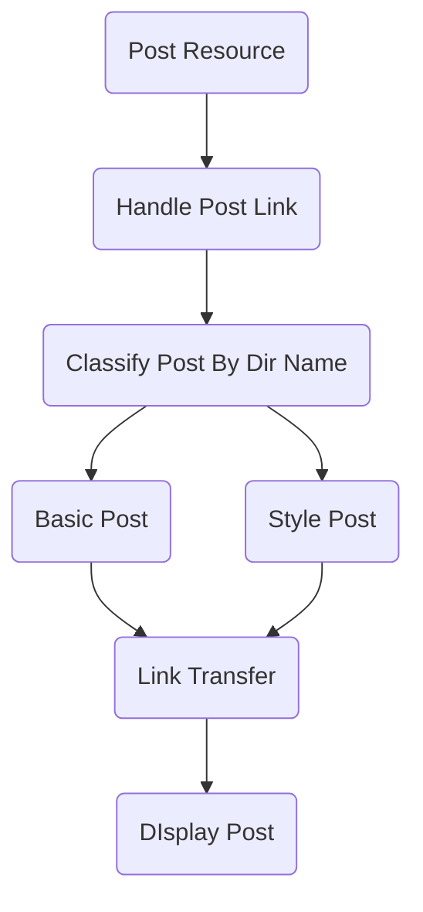

## Post Process

## 组件类

1. 基础组件（只包含样式， 及基础布局）
2. 样式组件（只包含样式的成型组件）
3. 业务组件（包含样式及业务功能组件）
4. 视图组件（以业务组件为基准进行页面元素布局组件）

## 路由类

1. 页面组件（路由组件，视图组件逻辑，数据传输）

## 伺服类

### 共通服务

1. DDD 模型类
2.

### 布局数据服务

### 博客数据服务

Post
Archive
Tag

## 服务类

### 博客服务

1. 静态数据检索服务
