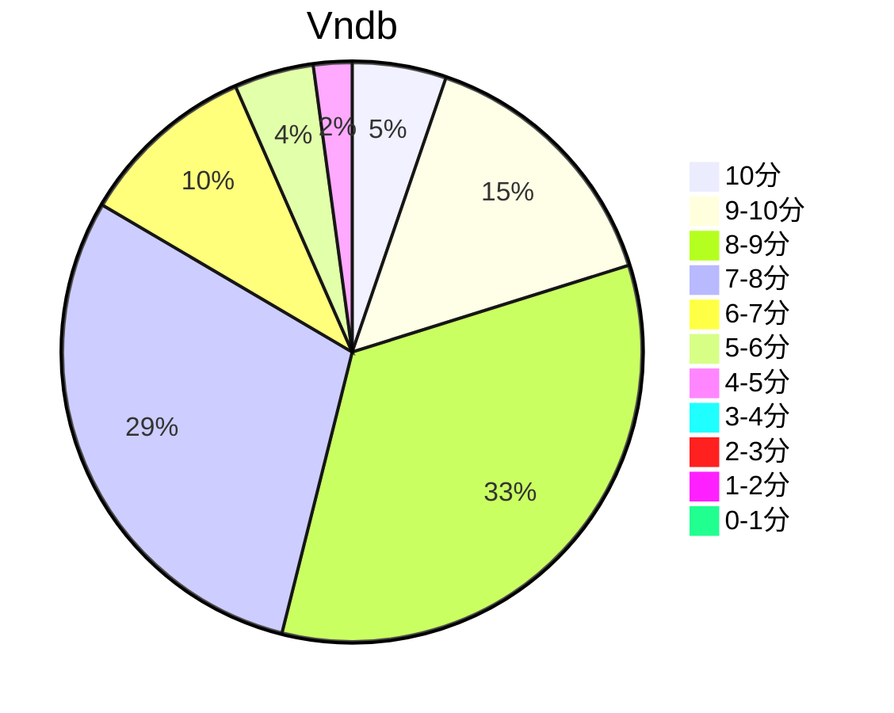

## 状态信息
### 基本信息
| 属性 | 数值 |
| --- | --- |
| 平台 | PC |
| 游戏 | 命运脉动/红色约定 |
| 原名 | Fortune Arterial (フォーチュンアテリアル) |
| 会社 | AUGUST |
| 成就 | - |
| 收集 | FULL CG |
| 天数 | 6 |
| 时长 | 37-38h |
| 引擎 | Ethornell |
| 系列 | - |

### 游戏信息
| 属性 | 数值 |
| --- | --- |
| 制作统括/总指挥 | るね |
| 人物设计/原画 | べっかんこう |
| 剧本 | 榊原拓、内田ヒロユキ、安西秀明 |
| 剧本协力 | 冈田留奈 |
| CG统括 | 里见藤久 |
| 背景 | 阿舎利ん_16、北川由貴、ゆうろ、紀山聡、有限会社シルバー、wiza kun |
| 演出 | 北川由贵 |
| 电影 | 北川由贵、Iris motion graphics |
| チビキャラアイコン | 脳みそホエホエ |
| 赞助 | よもぎ |
| 音乐 | Active Planets |

### 发行信息
| 日期 | 版本 |
| --- | --- |
| 2008-01-25 | 初回限定盘 |
| 2008-02-29 | 通常盘 |
| 2011-07-29 | Ver. Win7 |
| 2015-03-06 | Ver. DL |

## 状态统计
### 记录汇总
| 记录项 | 记录数值 |
| --- | --- |
| 天数间隔 | 18 |
| 有效天数 | 6 |
| 起始日期 | 2023-11-23 22:26:00 |
| 结束日期 | 2023-12-10 16:09:00 |
| 片段数量 | 16 |
| 总时长 | 37:47:00 |
| 最短片段 | 00:11:00 |
| 最长片段 | 06:13:00 |

### 线路汇总
| 周目 | 线路 | 次数 | 故事时长 | 额外时长 | 游戏时长 | 线路时长 |
| --- | --- | --- | --- | --- | --- | --- |
| 1 | 白线 | 1 | 04:41:00 | - | 04:41:00 | 10:08:00 |
| 2 | 阳菜线 | 1 | 05:39:00 | - | 05:39:00 | 11:06:00 |
| 3 | 桐叶线 | 1 | 05:57:00 | - | 05:57:00 | 11:24:00 |
| 4 | 姐线 | 1 | 02:37:00 | - | 02:37:00 | 08:04:00 |
| 5 | 女主线 | 1 | 04:59:00 | - | 04:59:00 | 10:26:00 |
| 6 | 附录 | 1 | 01:16:00 | - | 01:16:00 | 01:16:00 |
| 7 | True End | 1 | 07:00:00 | - | 07:00:00 | 12:27:00 |
| 8 | Normal End | 1 | 00:11:00 | - | 00:11:00 | 05:38:00 |

## 游戏评分
| 评分项 | 分数 | 占比 |
| --- | --- | --- |
| 评价 | 8.5 | - |
| BGM | 9.2 | - |
| 剧情 | 8.5 | - |
| 人物 | 9.0 | - |
| CG | 9.2 | - | 
| 动画 | - | - |

## 游戏分析
### 布局分析
树形分支、6次人物图进入线路。打完所有人物线路解锁TE，出现于首选图的黑猫。

### Bug汇总
- Win10运行原版本(Win7版本) - OP黑屏无法加载，但有声音。

### 线路汇总
- えりか - 男主成为了千堂的眷属，一起永生。
- しろ - 脱离了家族，选择了爱情，得到了哥的祝福。
- きりは - 寻求未知的主人。
- かなで - 种下希望的种子。
- ひな - 解决与奏家庭间的误解。
- NE - 音乐社三人打工日常。
- TE - 母上回归，千堂恢复，子孙满堂。

Tips: 
1. TE > 白 = 千堂 = 阳菜 = 桐叶 > 奏
2. 个人线全通解锁TE，乱选进NE。
3. 桐叶x2 -> 奏 -> 阳菜 => 五人齐聚学生会的小彩蛋。-> 千堂 -> 白 => NE

## 评价
### 标签
校园、吸血鬼、亲情、眷属、神乐

### 提示
无

### 经典
无

### 感想
早年看过动漫，游戏的TE的那个BGM带来了不小小感动。日常内容基本是点到即止，节奏控制很好。算是以gal的形式回忆这部作品吧。重温八月脸的感动，Oh，秽翼，Oh，皇姬。

## 站点信息
### 游玩时长
| 站点 | 时长 | 自动 | 最慢 | 最快 | 正常 |
| --- | --- | --- | --- | --- | --- | 
| vndb | 30h47m | 24h38m | 46h | 26h28m | 22h11m |

### 站点评分表
| 站点 | 评分 | 平均 | 人数 | 最高分 | 最低分 | 偏差 |
| --- | --- | --- | --- | --- | --- | --- |
| vndb | 7.46 | 7.46 | 753 | 10 | 2 | - |

### 站点评分区间图

## 游戏图片
### CG截图







### 游戏截图




### 相关链接
[官方公式](https://august-soft.com/fa/)
[动漫公式](https://www.tv-tokyo.co.jp/contents/fortune/)