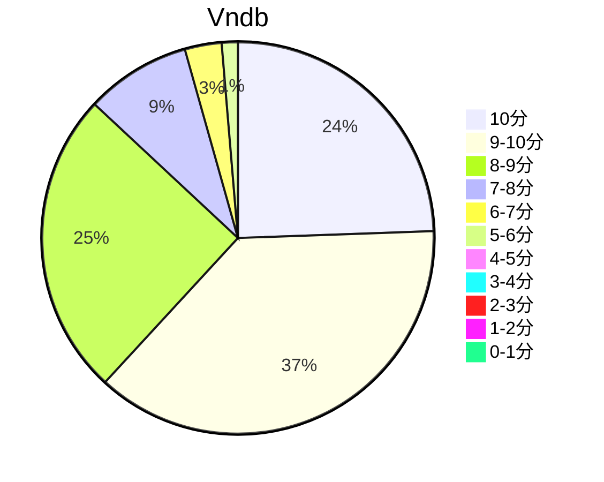

## 状态信息
### 基本信息
| 属性 | 数值 |
| --- | --- |
| 平台 | PSV |
| 游戏 | 寒蝉鸣泣之时粹 |
| 原名 | ひぐらしのなく頃に粋 |
| 会社 | 07th Expansion |
| 成就 | PS Trophy |
| 收集 | FULL CG |
| 天数 | 20 |
| 时长 | 210-211h |
| 系列 | 鸣泣之时系列 |
| 引擎 | NScripter |

### 游戏信息
| 属性 | 数值 |
| --- | --- |
| 原作·剧本监修 | 龙骑士07 |
| 剧本构成·监督 | 叶希一 |
| 编剧 | 叶希一、宫城季诗子、中村慎介 |
| 角色设计·原画 | rato |
| 音乐 | 5zizz（5pb.、ZIZZ Studio）、dai、ラック眼力 |
| 主机版主题曲全作词作曲 | 志仓千代丸 |
| 影片 | yo-yu |

### 发行信息
| 日期 | 合集版本 |
| --- | --- |
| 2015-03-12 | PSV |
| 2023-06-22 | NS |

## 状态统计
### 记录汇总
| 记录项 | 记录数值 |
| --- | --- |
| 天数间隔 | 20 |
| 有效天数 | 20 |
| 起始日期 | 2023-12-11 16:45:05 |
| 结束日期 | 2023-12-30 20:05:05 |
| 片段数量 | 78 |
| 片总时长 | 210:07:00 |
| 最短片段 | 00:08:00 |
| 最长片段 | 08:40:00 |

### 线路汇总
| 周目 | 事件 | 起始时间 | 结束时间 | 事件时长 | 事件长支时长 | 事件短支时长 | 总时长 |
| --- | --- | --- | --- | --- | --- | --- | --- |
| 1 | 共通ルート | 00:00:00 | 05:10:00 | 05:10:00 | 05:10:00 | 00:00:00 | 05:10:00 |
| 2 | 盥回し編 END | 05:10:00 | 09:56:00 | 04:46:00 | 09:56:00 | 09:56:00 | 09:56:00 |
| 3 | 鬼隠し編 END | 09:56:00 | 18:14:00 | 08:18:00 | 13:28:00 | 13:28:00 | 13:28:00 |
| 4 | 綿流し編 END | 18:14:00 | 29:48:00 | 11:34:00 | 16:44:00 | 16:44:00 | 16:44:00 |
| 5 | 祟殺し編 END | 31:41:00 | 43:26:00 | 11:45:00 | 16:55:00 | 16:55:00 | 16:55:00 |
| 6 | 憑落し編 END | 43:26:00 | 49:09:00 | 05:43:00 | 10:53:00 | 10:53:00 | 10:53:00 |
| 7 | 染伝し編 END | 49:09:00 | 56:53:00 | 07:44:00 | 12:54:00 | 12:54:00 | 12:54:00 |
| 8 | 暇潰し編 BADEND | 59:02:00 | 61:57:00 | 02:55:00 | 05:04:00 | 05:04:00 | 05:04:00 |
| 9 | 暇潰し編 END | 61:57:00 | 64:02:00 | 02:05:00 | 04:14:00 | 04:14:00 | 04:14:00 |
| 10 | 目明し編 BADEND | 74:37:00 | 75:01:00 | 00:24:00 | 10:59:00 | 10:59:00 | 10:59:00 |
| 11 | 目明し編 END | 75:01:00 | 75:51:00 | 00:50:00 | 11:25:00 | 11:25:00 | 11:25:00 |
| 12 | 昼壊し編 BADEND | 77:46:00 | 77:55:00 | 00:09:00 | 02:04:00 | 02:04:00 | 02:04:00 |
| 13 | 昼壊し編 END | 77:55:00 | 78:41:00 | 00:46:00 | 02:41:00 | 02:41:00 | 02:41:00 |
| 14 | 影紡し編 END | 78:41:00 | 89:08:00 | 10:27:00 | 00:00:00 | 00:00:00 | 10:27:00 |
| 15 | 罪滅し編 BADEND1 | 89:08:00 | 96:43:00 | 07:35:00 | 00:00:00 | 00:00:00 | 07:35:00 |
| 16 | 宵越し編 BADEND1 | 98:09:00 | 101:40:00 | 03:31:00 | 04:57:00 | 04:57:00 | 04:57:00 |
| 17 | 宵越し編 END | 101:40:00 | 106:11:00 | 04:31:00 | 05:57:00 | 05:57:00 | 05:57:00 |
| 18 | 宵越し編 BADEND2 | 106:11:00 | 107:45:00 | 01:34:00 | 03:00:00 | 03:00:00 | 03:00:00 |
| 19 | 宵越し編 BADEND3 | 107:45:00 | 108:21:00 | 00:36:00 | 02:02:00 | 02:02:00 | 02:02:00 |
| 20 | 罪滅し編 BADEND2 | 114:29:00 | 114:30:00 | 00:01:00 | 06:09:00 | 06:09:00 | 06:09:00 |
| 21 | 罪滅し編 END | 114:30:00 | 115:53:00 | 01:23:00 | 07:31:00 | 07:31:00 | 07:31:00 |
| 22 | 皆殺し編 END | 115:53:00 | 130:31:00 | 14:38:00 | 00:00:00 | 00:00:00 | 14:38:00 |
| 23 | 解々し編 END | 130:31:00 | 137:12:00 | 06:41:00 | 00:00:00 | 00:00:00 | 06:41:00 |
| 24 | 鹰野三四 序章 | 137:12:00 | 139:56:00 | 02:44:00 | 00:00:00 | 00:00:00 | 02:44:00 |
| 25 | 祭囃し編 END | 147:33:00 | 155:24:00 | 07:51:00 | 00:00:00 | 00:00:00 | 07:51:00 |
| 26 | カケラの世界 賽殺し編 END | 155:24:00 | 159:14:00 | 03:50:00 | 00:00:00 | 00:00:00 | 03:50:00 |
| 27 | 澪尽し編・裏 END | 163:08:00 | 177:55:00 | 14:47:00 | 00:00:00 | 00:00:00 | 14:47:00 |
| 28 | 澪尽し編・表 BADEND1 | 182:13:00 | 182:17:00 | 00:04:00 | 04:22:00 | 04:22:00 | 04:22:00 |
| 29 | 澪尽し編・表 BADEND2 | 182:36:00 | 182:54:00 | 00:18:00 | 04:55:00 | 00:37:00 | 04:55:00 |
| 30 | 澪尽し編・表 BADEND3 | 183:28:00 | 183:49:00 | 00:21:00 | 05:32:00 | 00:55:00 | 05:32:00 |
| 31 | 澪尽し編・表 END | 183:49:00 | 196:28:00 | 12:39:00 | 17:50:00 | 13:13:00 | 17:50:00 |
| 32 | 言祝し編 END | 196:28:00 | 206:47:00 | 10:19:00 | 00:00:00 | 00:00:00 | 10:19:00 |
| 33 | カケラの世界 カケラ紡ぎ END | 206:47:00 | 206:51:00 | 00:04:00 | 00:00:00 | 11:35:00 | 11:35:00 |
| 34 | 羞晒し編 END | 206:51:00 | 208:26:00 | 01:35:00 | 00:00:00 | 00:00:00 | 01:35:00 |
| 35 | ルート探索 | 209:04:00 | 210:07:00 | 01:03:00 | 00:00:00 | 03:34:00 | 03:34:00 |

| 索引 | 事件组 | 组事件时长 | 相关事件组 |
| --- | --- | --- | --- |
| 1 | 盥回し | 04:46:00 | - |
| 2 | 鬼隠し | 08:18:00 | - |
| 3 | 綿流し | 11:34:00 | - |
| 4 | 祟殺し | 11:45:00 | - |
| 5 | 憑落し | 05:43:00 | - |
| 6 | 染伝し | 07:44:00 | - |
| 7 | 暇潰し | 07:09:00 | - |
| 8 | 目明し | 11:49:00 | - |
| 9 | 昼壊し | 02:50:00 | - |
| 10 | 影紡し | 10:27:00 | - |
| 11 | 宵越し | 11:38:00 | - |
| 12 | 罪滅し | 15:07:00 | - |
| 13 | 皆殺し | 14:38:00 | - |
| 14 | 解々し | 06:41:00 | - |
| 15 | 祭囃し | 07:51:00 | - |
| 16 | 賽殺し | 03:50:00 | - |
| 17 | 澪尽し・裏 | 14:47:00 | - |
| 18 | 澪尽し・表 | 18:33:00 | - |
| 19 | 言祝し | 10:19:00 | - |
| 20 | カケラ紡ぎ | 11:35:00 | - |
| 21 | 羞晒し | 01:35:00 | - |
| 22 | 書庫：興宮警察署事件調書 | 49:50:00 | 盥回し、鬼隠し、綿流し、祟殺し、憑落し、染伝し |
| 23 | 書庫：警視庁公安部第七室捜査ファイル | 32:15:00 | 暇潰し、目明し、昼壊し、影紡し |
| 24 | 書庫：警察庁広報室管理資料 | 48:04:00 | 宵越し、罪滅し、皆殺し、解々し |
| 25 | 書庫：カケラの世界 | 66:55:00 | 祭囃し、賽殺し、澪尽し・裏、澪尽し・表、言祝し、カケラ紡ぎ |
| 26 | 書庫：Kの事件簿 | 01:35:00 | 羞晒し |
| 27 | アニメ：ひぐらしのなく頃に | 38:46:00 | 鬼隠し、綿流し、祟殺し、暇潰し |
| 28 | アニメ：ひぐらしのなく頃に解 | 49:25:00 | 目明し、罪滅し、皆殺し、祭囃し |
| 29 | アニメ：ひぐらしのなく頃に礼 | 06:40:00 | 賽殺し、昼壊し |
| 30 | キャラ：夏美 | 18:11:00 | 染伝し、影紡し |
| 31 | キャラ：巴 | 17:08:00 | 影紡し、解々し |
| 32 | ルート：本編集 | 125:18:00 | 言祝し、アニメ：ひぐらしのなく頃に、アニメ：ひぐらしのなく頃に解、アニメ：ひぐらしのなく頃に礼、澪尽し・表、書庫：Kの事件簿 |
| 33 | ルート：外転集 | 35:19:00 | キャラ：夏美、キャラ：巴 |

## 游戏评分
| 评分项 | 分数 | 占比 |
| --- | --- | --- |
| 评价 | 9.5 | - |
| BGM | 9.4 | - |
| 剧情 | 9.5 | - |
| 人物 | 9.0 | - |
| CG | 9.1 | - |

## 游戏分析
### 布局分析
- 篇章 - 出题 + 过渡 + 题解 + 碎片世界 + 事件
- 选项 - 部分大分支，选项决定开启的篇章以及通往的BE

### Bug汇总
无

### 线路汇总
- 主线 - 解开村子的谜题
- 外传 - 打击犯罪团伙

Tips: 
1. 游戏事件分组为上表的书库系列，本篇和外传为路线系列。没添加的篇章就是附加没那么重要的部分。

## 评价
### 标签
悬疑、热血、战斗、轮回、警匪、沙盒、生存、社会、日常、校园、村庄、神、鬼、传说

### 提示
问题部分就快速扫描一眼，然后PS键暂停，网页查询即可。最后的L4只能错一个。

### 口头禅
梨花: にぱ～
レナ: お持ち帰り～

### 感想
比动漫精彩多了，篇章补全和细节补全。开始的出题看着魔幻，后面解题篇章从凶手或者第三方的角度看清楚事件的发生的时候，感觉很棒，不存在所谓的悬疑。由于世界本身就是存在部分异能，所以有些遗留的坑是没填的，不过问题不明显。羽入的历史传和部分外传的质量不熟于本篇07th的剧情。总体感觉很精彩，不仅从点线面的角度得到了寒蝉故事的宏观世界观念，而且每个故事都有其精彩动人的瞬间，良好人物形象塑造，比如诗音(有点极端)，羽入(言祝篇补全)，梨花(有点迷惑，但不难理解)。大体上的感觉是关于梨花和羽入成长的故事。K1在主线算主角，世界观方面算励志向的辅助人物。

## 站点信息
### 游玩时长
| 站点 | 时长 | 自动 | 最慢 | 最快 | 正常 |
| --- | --- | --- | --- | --- | --- | 
| vndb | 48h30m | 53h55m | 352h | 35h | 52h14m |

### 站点评分表
| 站点 | 评分 | 平均 | 人数 | 最高分 | 最低分 | 偏差 |
| --- | --- | --- | --- | --- | --- | --- |
| vndb | 8.55 | 8.55 | 7560 | 10 | 1 | - |

### 站点评分区间图

## 游戏图片
### CG截图
无

### 游戏截图
无

### 相关链接
[官方公式](http://07th-expansion.net/)