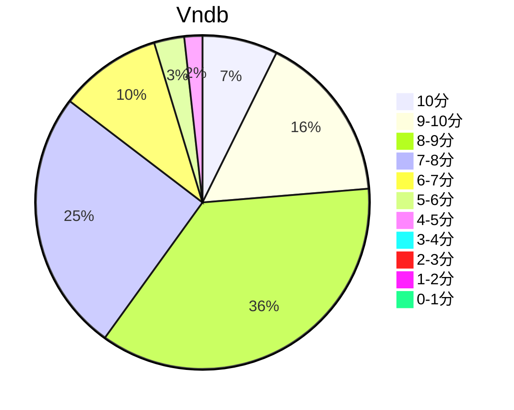

## 状态信息
### 基本信息
| 属性 | 数值 |
| --- | --- |
| 平台 | PC |
| 游戏 | 月影魅像 -解放之羽- |
| 原名 | 月影のシミュラクル -解放の羽- |
| 会社 | あっぷりけ |
| 成就 | - |
| 收集 | FULL CG |
| 天数 | 3 |
| 时长 | 12-13h |

### 游戏信息
| 属性 | 数值 |
| --- | --- |
| 导演 | 憲yuki |
| 企划 | 桐月 |
| 剧本 | 桐月 |
| 原画 | オダワラハコネ |
| 音乐 | 鷹石しのぶ（ReSound Wave） |

### 发行信息
| 日期 | 合集版本 |
| --- | --- |
| 2017-01-27 | Windows |
| 2019-07-26 | Steam |

## 状态统计
### 记录汇总
| 记录项 | 记录数值 |
| --- | --- |
| 天数间隔 | 16 |
| 有效天数 | 3 |
| 起始日期 | 2023-12-21 06:00:51 |
| 结束日期 | 2024-01-05 23:03:51 |
| 片段数量 | 6 |
| 片总时长 | 12:11:00 |
| 最短片段 | 00:14:00 |
| 最长片段 | 05:22:00 |

### 线路汇总
| 周目 | 事件 | 起始时间 | 结束时间 | 事件时长 | 事件长支时长 | 事件短支时长 | 总时长 |
| --- | --- | --- | --- | --- | --- | --- | --- |
| 1 | 夜:暗夜航路 END | 00:00:00 | 02:44:00 | 02:44:00 | 00:00:00 | 00:00:00 | 02:44:00 |
| 2 | 夜:一个终结 END | 02:44:00 | 03:11:00 | 00:27:00 | 00:00:00 | 00:00:00 | 00:27:00 |
| 3 | 美依:困惑的家 END | 03:11:00 | 03:46:00 | 00:35:00 | 00:00:00 | 00:00:00 | 00:35:00 |
| 4 | 美依:回家的路 END | 03:46:00 | 04:41:00 | 00:55:00 | 00:00:00 | 00:00:00 | 00:55:00 |
| 5 | 美依:丧失 END | 04:41:00 | 04:59:00 | 00:18:00 | 00:00:00 | 00:00:00 | 00:18:00 |
| 6 | 一叶:泡沫的梦 END | 04:59:00 | 07:04:00 | 02:05:00 | 00:00:00 | 00:00:00 | 02:05:00 |
| 7 | 一叶:孤独的旋律 END | 07:04:00 | 07:25:00 | 00:21:00 | 00:00:00 | 00:00:00 | 00:21:00 |
| 8 | 零&红:净化 END | 07:25:00 | 08:08:00 | 00:43:00 | 00:00:00 | 00:00:00 | 00:43:00 |
| 9 | 零:旅路 END | 08:08:00 | 09:56:00 | 01:48:00 | 00:00:00 | 00:00:00 | 01:48:00 |
| 10 | 红:险祭 END | 09:56:00 | 10:24:00 | 00:28:00 | 00:00:00 | 00:00:00 | 00:28:00 |
| 11 | 红:未来之羽 END | 10:24:00 | 10:50:00 | 00:26:00 | 00:00:00 | 00:00:00 | 00:26:00 |
| 12 | 零:泪雨 END | 10:50:00 | 11:02:00 | 00:12:00 | 00:00:00 | 00:00:00 | 00:12:00 |
| 13 | 红:解放之羽 END | 11:02:00 | 11:38:00 | 00:36:00 | 00:00:00 | 00:00:00 | 00:36:00 |
| 14 | 红:EX END | 11:38:00 | 12:11:00 | 00:33:00 | 00:00:00 | 00:00:00 | 00:33:00 |

## 游戏评分
| 评分项 | 分数 | 占比 |
| --- | --- | --- |
| 评价 | 8.2 | - |
| BGM | 8.5 | - |
| 剧情 | 7.9 | - |
| 人物 | 8.5 | - |
| CG | 8.5 | - |

## 游戏分析
### 布局分析
系统引导式分支解锁，顺序如下: 夜 -> 美依 -> 一叶 -> 零 -> 红 -> 红EX

### 线路汇总
- 夜 - 初始线路，零奔赴火葬场
- 美依 - 身心上永远不可及的爱恋
- 一叶 - 茧之梦
- 零 - 放弃民俗在一起
- 红 - 逃离&觉醒
- 红EX - 红线的糖

Tips: 
1. 但引导式解锁，类似剧情锁。但一周目后悬疑感体验会有所下降，相反，糖量会增加。
2. 线路体验感: 红(Kurenai) > 零 = 一叶 > 美依(基本上BE)

## 评价
### 感想
悬疑感比较吸引我的注意，至少不困，有推下去的动力。一周目后这悬疑感就没了，至于真凶的话基本可以在新解锁的选项中找到。有种虎头蛇尾的感觉，但是红的糖分还是可以的，最惨就是美依，一叶的话起码都有个甜甜的恋爱。故事主要还是关于人偶之心的问题。由于是短篇，很多细节描述不足，内容有所欠缺，相应来说剧情较为紧凑。回忆的滤镜效果较好。

## 站点信息
### 游玩时长
| 站点 | 时长 | 自动 | 最慢 | 最快 | 正常 |
| --- | --- | --- | --- | --- | --- | 
| vndb | 14h18m | 14h35m | 16h30m | 9h21m | 15h |

### 站点评分表
| 站点 | 评分 | 平均 | 人数 | 最高分 | 最低分 | 偏差 |
| --- | --- | --- | --- | --- | --- | --- |
| vndb | 7.61 | 7.61 | 344 | 10 | 3 | - |

### 站点评分区间图

## 游戏图片
### CG截图




### 游戏截图




### 相关链接
[官方公式](http://www.applique-soft.com/tuki2/index.html)