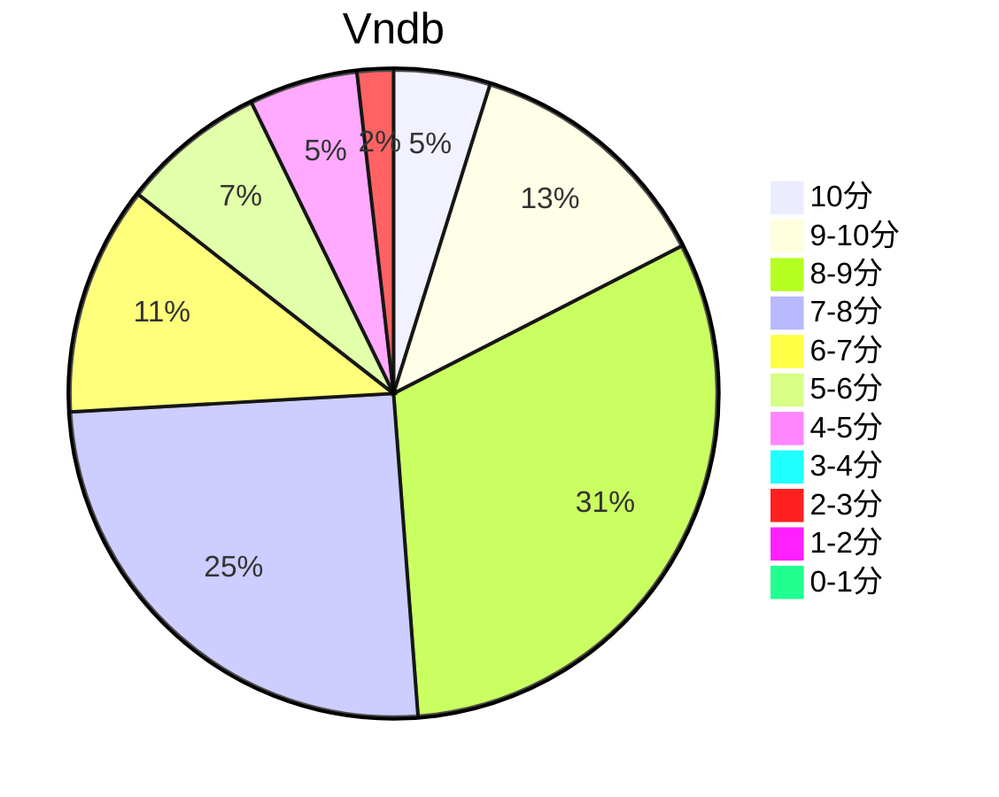

## 状态信息
### 基本信息
| 属性 | 数值 |
| --- | --- |
| 平台 | PC |
| 游戏 | 超级糖果～王道自有王道的理由！～ |
| 原名 | しゅぷれ～むキャンディ ～王道には王道たる理由があるんです!～ |
| 会社 | 枕 |
| 成就 | - |
| 收集 | FULL CG |
| 天数 | 6 |
| 时长 | 36-37h |

### 游戏信息
| 属性 | 数值 |
| --- | --- |
| 编剧 | 藤仓绚一、柚子璃刃、SCA-自 |
| 画师 | karory、梱枝莉子、狗神煌、水泽深森 |
| 音乐 | ピクセルビー、松本文纪 |

### 发行信息
| 日期 | 合集版本 |
| --- | --- |
| 2008-09-26 | Windows |

## 状态统计
### 记录汇总
| 记录项 | 记录数值 |
| --- | --- |
| 天数间隔 | 8 |
| 有效天数 | 6 |
| 起始日期 | 2024-01-02 01:49:02 |
| 结束日期 | 2024-01-09 11:31:02 |
| 片段数量 | 14 |
| 片总时长 | 36:41:00 |
| 最短片段 | 00:09:00 |
| 最长片段 | 04:22:00 |

### 线路汇总
| 周目 | 事件 | 起始时间 | 结束时间 | 事件时长 | 事件长支时长 | 事件短支时长 | 总时长 |
| --- | --- | --- | --- | --- | --- | --- | --- |
| 1 | 共通线 | 00:00:00 | 04:03:00 | 04:03:00 | 04:03:00 | 00:00:00 | 04:03:00 |
| 2 | 羽依 END | 04:03:00 | 11:14:00 | 07:11:00 | 11:14:00 | 11:14:00 | 11:14:00 |
| 3 | 向日葵 END | 11:14:00 | 13:50:00 | 02:36:00 | 06:39:00 | 06:39:00 | 06:39:00 |
| 4 | 朱里 END | 13:50:00 | 17:13:00 | 03:23:00 | 07:26:00 | 07:26:00 | 07:26:00 |
| 5 | 弓音 END | 17:13:00 | 20:55:00 | 03:42:00 | 07:45:00 | 07:45:00 | 07:45:00 |
| 6 | 时未 END | 20:55:00 | 24:25:00 | 03:30:00 | 07:33:00 | 07:33:00 | 07:33:00 |
| 7 | 悠莉 END | 24:25:00 | 28:35:00 | 04:10:00 | 08:13:00 | 08:13:00 | 08:13:00 |
| 8 | ジャコ END | 28:35:00 | 33:01:00 | 04:26:00 | 08:29:00 | 08:29:00 | 08:29:00 |
| 9 | ジャコ&悠莉 END | 33:01:00 | 36:41:00 | 03:40:00 | 07:43:00 | 07:43:00 | 07:43:00 |

## 游戏评分
| 评分项 | 分数 | 占比 |
| --- | --- | --- |
| 评价 | 8.5 | - |
| BGM | 8.9 | - |
| 剧情 | 8.2 | - |
| 人物 | 8.9 | - |
| CG | 8.8 | - |

## 游戏分析
### 布局分析
标准树形分支，一条隐藏线朱里，五线全通解锁杰可，流线全通解锁TE，选项则是进入杰可的选项。

### 线路汇总
魔法界线:

- 羽依 - 魔法委员会不同意这场爱恋，悠亲自前往魔法界寻找恋人。
- 悠莉 - 知悉悠莉身世后依旧持续这段爱恋，时而消失时而回归。
- ジャコ - 魔法界的因缘而致的恋爱，悠因ジャコ的唤醒而回归自我，ジャコ以人类之身与其相恋。
- ジャコ&悠莉 - ジャコ&悠莉的修罗场，打败附身悠莉的Boss，使用糖果实现了三个愿望，最后和ジャコ&悠莉幸福的在一起。（无HS）

旧式校园废萌线:

- 向日葵 - 生日会的小矛盾
- 朱里 - 父亲干扰女儿的爱恋
- 弓音 - 承认内心的爱恋
- 时未 - 近亲（全场魔幻的ehehe）

Tips: 
1. 线路感想: ジャコ&悠莉 > ジャコ = 悠莉 > 羽依 = 弓音 > 朱里 = 向日葵 > 时未
2. 时未线过于魔幻，剧情方面浪费了人设。

## 评价
### 感想
如题。王道自由王道的理由，因此感觉就是王道。线路总体割裂感强。日常线连魔法界的介绍都没有。魔法线和前面的日常完全是两个故事。基本上参与魔法线和真结局的人物都是狗姐话的角色，不得不说狗姐赛高。剧情看着还行，有股旧时代的感觉。按照周目顺序一开始是8然后5最后8.5，主要是的时未线太崩了。不过，自哥哥作品的风格还是挺喜欢的，特别是松本文纪的音乐让游戏升了一个级别。

## 站点信息
### 站点评分表
| 站点 | 评分 | 平均 | 人数 | 最高分 | 最低分 | 偏差 |
| --- | --- | --- | --- | --- | --- | --- |
| vndb | 7.15 | 7.15 | 162 | 10 | 2 | - |

### 站点评分区间图

## 游戏图片
### CG截图




### 游戏截图




### 相关链接
[官方公式](https://www.makura-soft.com/candy/index.html)