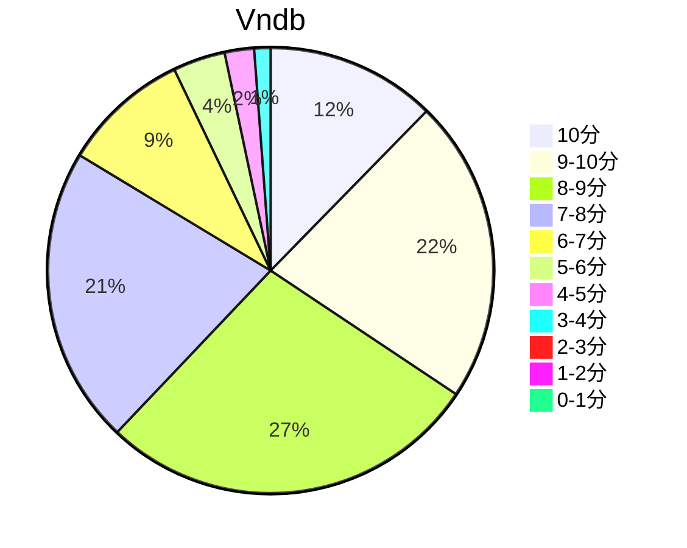

## 状态信息
### 基本信息
| 属性 | 数值 |
| --- | --- |
| 平台 | PC |
| 游戏 | 生命的备件 |
| 原名 | 生命のスペア |
| 会社 | あかべぇそふとすりぃ |
| 成就 | - |
| 收集 | FULL CG |
| 时长 | 13-14h |
| 性质 | 本篇 |
| 类型 | 生死 |
| 系列 | - |

### 游戏信息
| 属性 | 数值 |
| --- | --- |
| 总监 | 稲田有機 |
| 剧本 | 中岛大河 |
| 画师 | 秋空もみぢ |
| 音乐 | 西坂恭平 |

### 发行信息
| 日期 | 合集版本 |
| --- | --- |
| 2016-08-26 | Windows |

## 状态统计
### 记录汇总
| 记录项 | 记录数值 |
| --- | --- |
| 天数间隔 | 2 |
| 有效天数 | 2 |
| 起始日期 | 2024-01-19 04:08:27 |
| 结束日期 | 2024-01-20 05:48:27 |
| 片段数量 | 3 |
| 片总时长 | 13:22:00 |
| 最短片段 | 02:44:00 |
| 最长片段 | 06:13:00 |

### 线路汇总
| 周目 | 事件 | 起始时间 | 结束时间 | 事件时长 | 事件长支时长 | 事件短支时长 | 总时长 |
| --- | --- | --- | --- | --- | --- | --- | --- |
| 1 | 惠璃 Fin | 00:00:00 | 13:22:00 | 13:22:00 | 00:00:00 | 00:00:00 | 13:22:00 |

## 游戏评分
| 评分项 | 分数 | 占比 |
| --- | --- | --- |
| 评价 | 8.4 | - |
| BGM | 8.4 | - |
| 剧情 | 8.4 | - |
| 人物 | 8.9 | - |
| CG | 8.9 | - |

## 游戏分析
### 布局分析
单线

### 线路汇总
剧情杀的樱纹病，就是剧本里面无可救药的病种。男主和女主都患有，共同面临人生的最后一刻。

## 评价
### 经典
无

### 感想
在这个故事，我看到了面临生命最后一刻的无奈、沮丧与消沉，以及在最后一刻的坦然与释然。整体风格体现了日本倾向于对死的刻画以及樱花背后的象征意。虽然是快速看，但是内心还是小有起伏，尤其是转换了视角看故事后。里面没有坏人，只有对死不舍的人们以及看淡死的人们。女主妹妹最后立志成为医生解决该病症算是标准结局类型。对死亡过程的刻画没有想像中的细致，尤其是被死亡折磨的情感描写。也许是避免过多的问题，有意从简。但是缺乏这一个细节描写反而不利于故事进一步升华。即便如此，还是感受到故事的立意。最后的死亡之美还是有点小感触。不过现实中这种做法属于摆烂，然后走向魂肉交融。

## 站点信息
### 游玩时长
| 站点 | 时长 | 自动 | 最慢 | 最快 | 正常 |
| --- | --- | --- | --- | --- | --- | 
| vndb | 12h30m | 12h | 18h21m | 8h33m | 15h29m |

### 站点评分表
| 站点 | 评分 | 平均 | 人数 | 最高分 | 最低分 | 偏差 | rank |
| --- | --- | --- | --- | --- | --- | --- | --- |
| vndb | 7.69 | 7.69 | 427 | 10 | 1 | - | 718 |

### 站点评分区间图

## 游戏图片
### CG截图




### 游戏截图




### 相关链接
[官方公式](http://www.akabeesoft3.com/products/inochinospare/index.html)