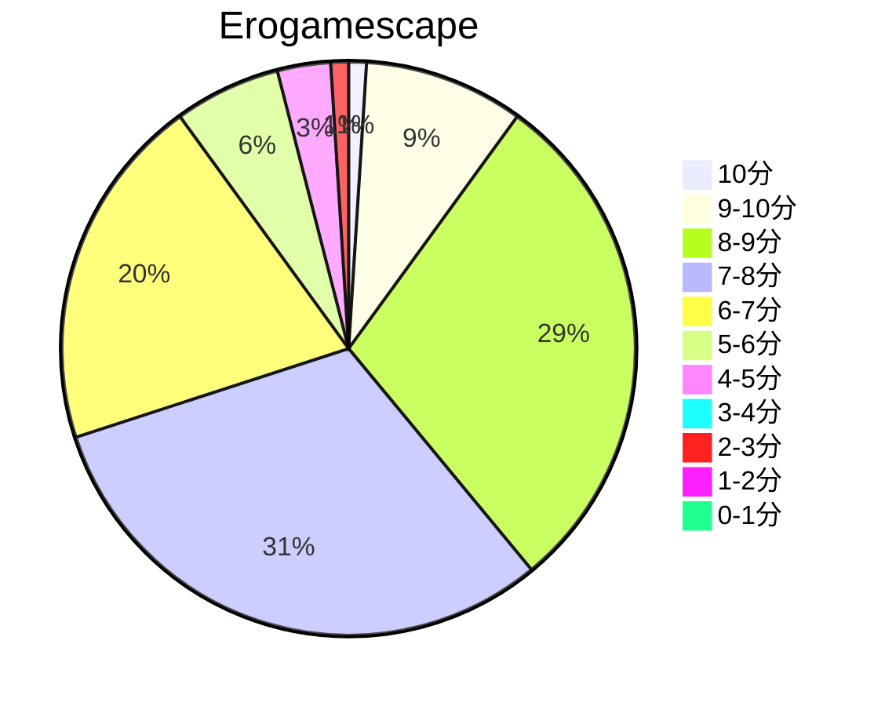
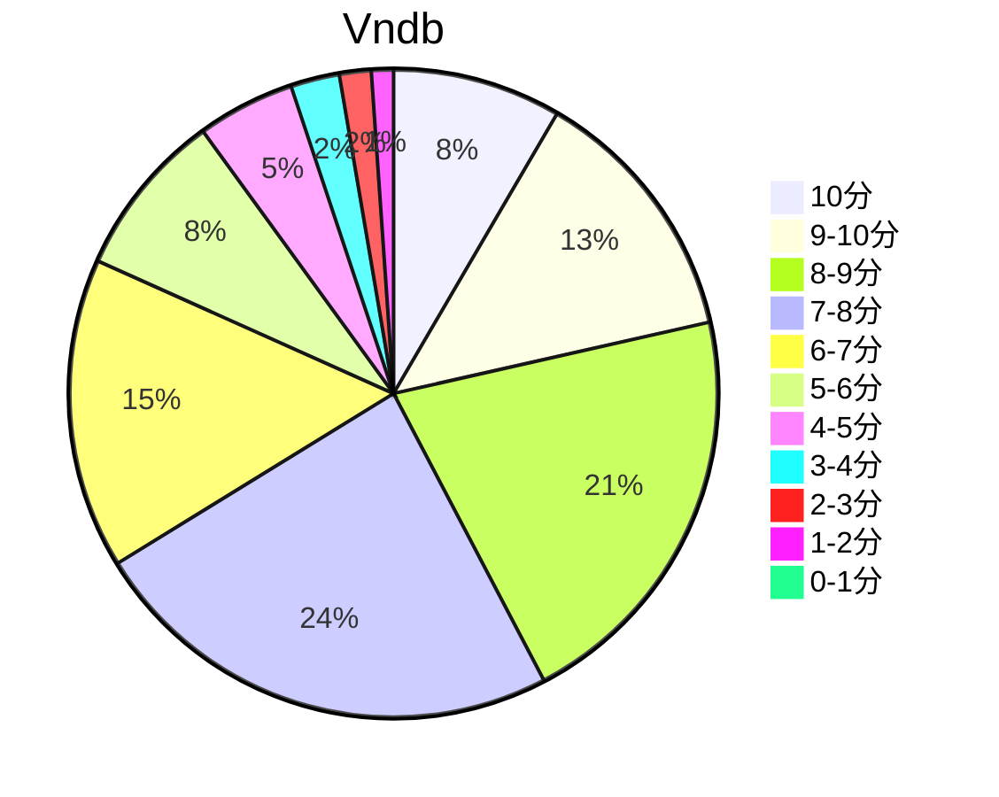

## 状态信息
### 基本信息
| 属性 | 数值 |
| --- | --- |
| 平台 | PC |
| 游戏 | Shiny Days |
| 原名 | Shiny Days |
| 会社 | Overflow |
| 成就 | FULL Flowchart |
| 收集 | FULL Replay |
| 天数 | 8 |
| 时长 | 50-56h |
| 系列 | Days |

### 游戏信息
| 属性 | 数值 |
| --- | --- |
| 开发 | Overflow |
| 企划、剧本、制作总指挥 | メイザーズぬまきち |
| 人物设计、总作画监督 | 后藤润二 |
| 作画监督 | 刻雨 |
| 原画 | 长森佳容、矢向宏志、仓岛丈康 |
| 美术监修 | 宫前光春 |
| 背景美术 | 仓田宪一 |
| 动画演出、分镜 | ほしかわたかふみ |
| 程序 | GON、向日葵正 |
| 音效演出 | 吉田博彦（ヨシダという生き物） |
| 音效监督 | 伊藤善之（ランティス） |
| 音效制作 | âge（アージュ） |
| 音效制作协力 | Lantis |
| 音乐 | KIRIKO/HIKO sound |
| 音响制作 | ホビボックス |
| OP电影 | 静かなる中条 |

### 发行信息
| 日期 | 版本 |
| --- | --- |
| 2012-04-27 | JP PC |
| 2015-09-25 | NA PC |

## 状态统计
### 记录汇总
| 记录项 | 记录数值 |
| --- | --- |
| 天数间隔 | 8 |
| 有效天数 | 8 |
| 起始日期 | 2023-11-01 13:30:00 |
| 结束日期 | 2023-11-08 12:47:00 |
| 片段数量 | 18 |
| 总时长 | 50:06:00 |
| 最短片段 | 00:04:00 |
| 最长片段 | 06:03:00 |

### 线路汇总
| 周目 | 线路 | 次数 | 故事时长 | 额外时长 | 游戏时长 | 线路时长 |
| --- | --- | --- | --- | --- | --- | --- |
| 1 | 失意 End | 1 | 00:04:00 | - | 00:04:00 | 01:21:00 |
| 2 | 奉納神楽 End (NoH) | 1 | 01:48:00 | - | 01:48:00 | 06:06:00 |
| 3 | 献身 End | 1 | 00:35:00 | - | 00:35:00 | 03:20:00 |
| 4 | 奉納神楽 End | 1 | 00:42:00 | - | 00:42:00 | 05:00:00 |
| 5 | 夏休み明けはうしろ指 End | 1 | 00:15:00 | - | 00:15:00 | 00:40:00 |
| 6 | 電車で何時間？ End | 1 | 04:31:00 | - | 04:31:00 | 08:58:00 |
| 7 | 可憐な夏 End | 1 | 00:04:00 | - | 00:04:00 | 00:29:00 |
| 8 | 涙尽きて End | 1 | 00:35:00 | - | 00:35:00 | 01:00:00 |
| 9 | 誠、貸します End | 1 | 03:21:00 | - | 03:21:00 | 03:46:00 |
| 10 | いつもの夏 End | 1 | 00:32:00 | - | 00:32:00 | 00:32:00 |
| 11 | みことのは End | 1 | 00:40:00 | - | 00:40:00 | 00:40:00 |
| 12 | 超親友の敗北 End | 1 | 00:09:00 | - | 00:09:00 | 00:09:00 |
| 13 | 狙われた巨塔 End | 1 | 00:23:00 | - | 00:23:00 | 00:23:00 |
| 14 | 友から先へ End | 1 | 00:06:00 | - | 00:06:00 | 00:06:00 |
| 15 | 双子の虜 End | 1 | 02:27:00 | - | 02:27:00 | 02:27:00 |
| 16 | 家族とともに End | 1 | 04:01:00 | - | 04:01:00 | 04:01:00 |
| 17 | インターセプト End | 1 | 00:20:00 | - | 00:20:00 | 00:20:00 |
| 18 | 必殺キック End | 1 | 00:17:00 | - | 00:17:00 | 00:17:00 |
| 19 | そして快楽へ End | 1 | 00:31:00 | - | 00:31:00 | 00:31:00 |
| 20 | 親娘ともども End1 | 1 | 00:05:00 | - | 00:05:00 | 00:05:00 |
| 21 | 刹那、消失 End | 1 | 01:26:00 | - | 01:26:00 | 01:26:00 |
| 22 | 思い出の場所なんてなかった End | 1 | 01:07:00 | - | 01:07:00 | 01:07:00 |
| 23 | お幸せに End | 1 | 00:29:00 | - | 00:29:00 | 00:29:00 |
| 24 | 二人のパリ End1 | 1 | 01:11:00 | - | 01:11:00 | 01:11:00 |
| 25 | ことぴーからせっちゃんへ End | 1 | 01:05:00 | - | 01:05:00 | 01:05:00 |
| 26 | 熟した果実 End | 1 | 01:26:00 | - | 01:26:00 | 01:26:00 |
| 27 | 桂家完全攻略計画 End | 1 | 00:05:00 | - | 00:05:00 | 00:05:00 |
| 28 | 懲りない誠 End | 1 | 00:14:00 | - | 00:14:00 | 00:14:00 |
| 29 | 共に有らん End1 | 1 | 00:38:00 | - | 00:38:00 | 00:38:00 |
| 30 | 原巳浜ラブトライアングル End | 1 | 00:42:00 | - | 00:42:00 | 00:42:00 |
| 31 | 母の恋人 End | 1 | 02:27:00 | - | 02:27:00 | 02:27:00 |
| 32 | 母として女として End | 1 | 00:12:00 | - | 00:12:00 | 00:12:00 |
| 33 | 四人のパリ End | 1 | 00:51:00 | - | 00:51:00 | 00:51:00 |
| 34 | 母の宴 End | 1 | 00:40:00 | - | 00:40:00 | 00:40:00 |
| 35 | 双子の蜜壷 End | 1 | 00:20:00 | - | 00:20:00 | 00:20:00 |
| 36 | 婿入りの儀式 End | 1 | 01:15:00 | - | 01:15:00 | 01:15:00 |
| 37 | それぞれの道へ End | 1 | 00:30:00 | - | 00:30:00 | 00:30:00 |
| 38 | 修羅は舞い降りた End | 1 | 00:29:00 | - | 00:29:00 | 00:29:00 |
| 39 | 代用 End | 1 | 00:04:00 | - | 00:04:00 | 00:04:00 |
| 40 | 父からの贈り物 End | 1 | 00:06:00 | - | 00:06:00 | 00:06:00 |
| 41 | 共に有らん End2 | 1 | 00:57:00 | - | 00:57:00 | 00:57:00 |
| 42 | 二人のパリ End2 | 1 | 00:08:00 | - | 00:08:00 | 00:08:00 |
| 43 | - | 1 | - | 02:16:00 | 02:16:00 | - |

## 游戏评分
| 评分项 | 分数 | 占比 |
| --- | --- | --- |
| 评价 | 9.2 | - |
| BGM | 8.9 | - |
| 剧情 | 9.0 | - |
| 人物 | 8.9 | - |
| CG | 0 | - | 
| 动画 | 8.7 | - |

## 游戏分析
### 布局分析
3条Route的平行世界:
- Route A(言叶&足利)
- Route B(刹那)
- Route C(母亲计划)

事件块:
- RA浅蓝-神乐祭
- RB浅紫-神乐晚会
- RC深粉-巴黎机场
- RC红色-桂家
- 分支节点与过程节点-母亲与个人与BE

### Bug汇总
- 进度条 [好感度] (已验证): Flowchart节点回溯时候好感度自动累加。

### 线路汇总
Tips: 线路过多就不汇总了，参考萌娘百科即可。除了BE基本上都有后日谈。部分结局重复次数有点多，细节差别是被恶搞的成哥和前面剧情有小片段的差异。最多的就是巴黎机场。

## 评价
### 标签
动画、长篇、爱情、后宫、Radish、打工、夏日、沙滩、神乐、恋爱、Days系列、人气、续作

### 提示
Bug算是最少的，仅好感度。但文本100%绝对是爱才能做到，重复率和细节选项的变化异常之多，跟前作的特性一样。结局几乎是原作的两倍四十几个结局。纯看图还真感觉不到这个数字是如此恐怖。攻略错误还是挺多的，建议多攻略结合并且时刻留意好感度变化。不走刹那千万不要刷过高的好感度。这次是关键选项加好感度进线，几乎是days系列的老传统。基本上同一线路剧情刷了将近40~50次，而且故事情节比本篇长不少。

### 经典
无

### 感想
剧情没前作这么恐怖，这作突出的是夏天及其相关的传统活动，更多的是诚哥的私生活。几乎所有在游戏的女性角色都可以P。至于结局的话，山县没私人结局。主要还是出场份额不多，关系参与比例不高。言叶和前作相比性格方面显得更加高雅，而不是腹黑和黑深残。这作的言叶基本将理想的女性元素融合在一起。本作的言叶可能是被世界带偏了。刹那线也是当年玩本体时候留下的唯一遗憾。在剧情结局数量方面，西园寺妈是最多的，而且最后那个场面还真是笑死了。这部作品还有个别名叫 Mother Days。

## 站点信息
### 游玩时长
| 站点 | 时长 | 自动 | 最慢 | 最快 | 正常 |
| --- | --- | --- | --- | --- | --- | 
| vndb | 36h | 40h | 57h5m | 45h25m | 34h |

### 站点评分表
| 站点 | 评分 | 平均 | 人数 | 最高分 | 最低分 | 偏差 |
| --- | --- | --- | --- | --- | --- |  --- |
| erogamescape | 7.5 | 7.3 | 100 | 10.0 | 2.0 | 1.4 |
| vndb | 6.99 | 6.99 | 820 | 10 | 1 | - |

### 站点评分区间图

## 游戏图片
### CG截图




### 游戏截图




### 全线路图(Ctrl+M)

### 相关链接
[官方公式](https://0verflow.com/products/shinydays/)
[英文公式](https://shinydays.us/)