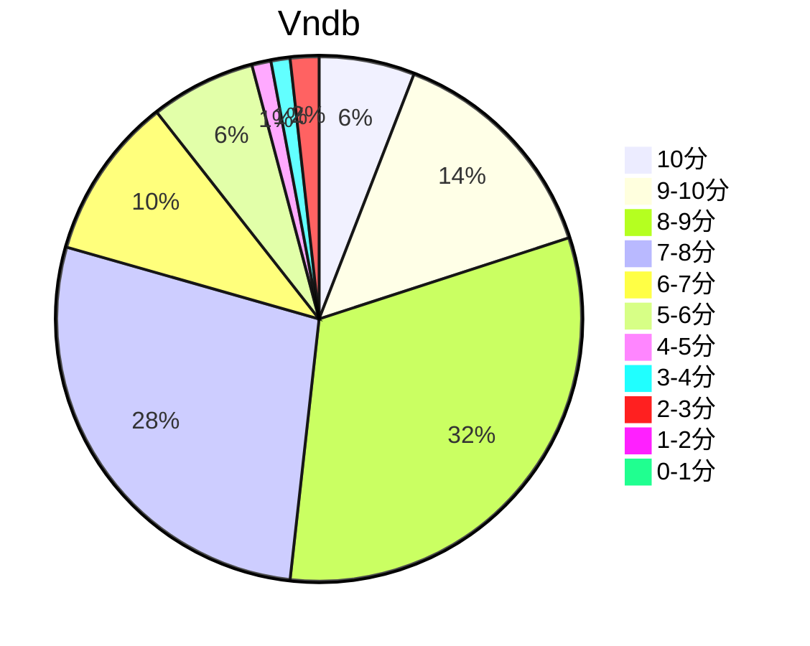

## 状态信息
### 基本信息
| 属性 | 数值 |
| --- | --- |
| 平台 | PC |
| 游戏 | 天使不在的12月(December When There is No Angel) |
| 原名 | 天使（てんし）のいない１２月（がつ） |
| 会社 | Leaf |
| 成就 | - |
| 收集 | FULL CG |
| 天数 | 3 |
| 时长 | 9-12h |

### 游戏信息
| 属性 | 数值 |
| --- | --- |
| 制作人 | 下川直哉 |
| 监督 | 鹫见努 |
| 企画 | 三宅章介 |
| 画师 | 中村毅、みつみ美里 |
| CG监修 | 甘露树 |
| 音乐 | 松冈纯也、石川真也、下川直哉、中上和英 |

### 发行信息
| 日期 | 合集版本 |
| --- | --- |
| 2003-09-26 | Windows |

## 状态统计
### 记录汇总
| 记录项 | 记录数值 |
| --- | --- |
| 天数间隔 | 5 |
| 有效天数 | 3 |
| 起始日期 | 2024-01-07 13:47:12 |
| 结束日期 | 2024-01-11 02:58:12 |
| 片段数量 | 5 |
| 片总时长 | 08:59:00 |
| 最短片段 | 00:15:00 |
| 最长片段 | 04:41:00 |

### 线路汇总
| 周目 | 事件 | 起始时间 | 结束时间 | 事件时长 | 事件长支时长 | 事件短支时长 | 总时长 |
| --- | --- | --- | --- | --- | --- | --- | --- |
| 1 | 一周目:明日菜 END | 00:00:00 | 05:55:00 | 05:55:00 | 00:00:00 | 00:00:00 | 05:55:00 |
| 2 | 二周目:透子 END | 05:55:00 | 06:46:00 | 00:51:00 | 00:00:00 | 00:00:00 | 00:51:00 |
| 3 | 三周目:しのぶ END | 06:46:00 | 07:06:00 | 00:20:00 | 00:00:00 | 00:00:00 | 00:20:00 |
| 4 | 四周目:真帆 END | 07:06:00 | 07:57:00 | 00:51:00 | 00:00:00 | 00:00:00 | 00:51:00 |
| 5 | 五周目:雪緒 END | 07:57:00 | 08:59:00 | 01:02:00 | 00:00:00 | 00:00:00 | 01:02:00 |

## 游戏评分
| 评分项 | 分数 | 占比 |
| --- | --- | --- |
| 评价 | 8.6 | - |
| BGM | 9.2 | - |
| 剧情 | 8.6 | - |
| 人物 | 8.8 | - |
| CG | 8.6 | - |

## 游戏分析
### 布局分析
起始三选项将决定真线路，否则假线路。真线路有ED附赠。选项一（明日菜、透子、忍），选项二（雪绪），选项三（真帆）

### 线路汇总
雪绪 - 追寻活着的意义（感受尚存的温柔）
明日菜 - 互舔伤口
透子 - 笨笨子的恋爱
忍 - 肉体之恋
真帆 - 电灯泡的别离

Tips: 
1. 线路感想: 雪绪 > 明日菜 > 透子 = 忍 = 真帆
2. 负面背景有点多。世界线是悲观的人生。电波对不上不建议游玩。

## 评价
### 经典
那并不永恒，也不真实，只是一份曾经存在于那里的感情......
それは永遠でなく、真実でなく。ただ、そこにあるだけの想い…

### 感想
总体而言，雪绪线带来的氛围感可以，明日菜前期的活跃状态下基本是理想的大姐姐，而且雪绪的HS及其CG算是看起来有感觉的一类。游戏整体节奏短平快，没有白开水，只有带有小负面的剧情片段。虽说H占据主导，但是H更多的是作为悲观状态下的兴奋剂，让大脑维持着基本的运转能力。雪，片刻钟的美好。更多的是没有灵魂的爱恋，仅仅是安慰剂。Eve。这种题材不宜长，短了描写就没有那么深刻，相对而言情感面上接触时间段，情感反馈相对较弱。属于喜欢但不会推荐系列。

## 站点信息
### 游玩时长
| 站点 | 时长 | 自动 | 最慢 | 最快 | 正常 |
| --- | --- | --- | --- | --- | --- | 
| vndb | 14h53m | 14h53m | 17h29m | 11h | 14h53m |

### 站点评分表
| 站点 | 评分 | 平均 | 人数 | 最高分 | 最低分 | 偏差 |
| --- | --- | --- | --- | --- | --- | --- |
| vndb | 7.33 | 7.33 | 168 | 10 | 2 | - |

### 站点评分区间图

## 游戏图片
### CG截图




### 游戏截图




### 相关链接
[官方公式](https://leaf.aquaplus.jp/product/ten/)