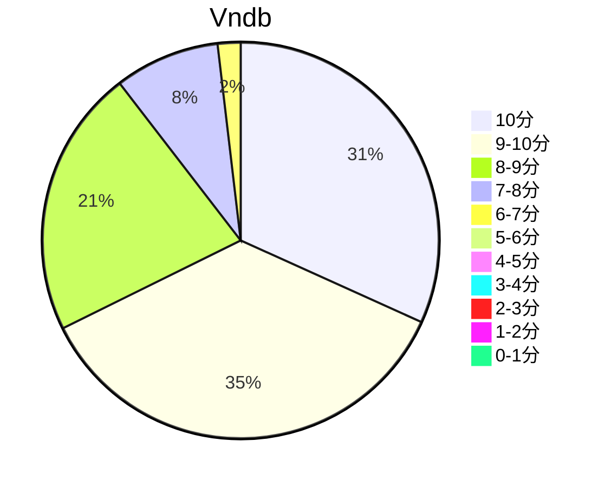

## 状态信息
### 基本信息
| 属性 | 数值 |
| --- | --- |
| 平台 | PC |
| 游戏 | 苍之彼方的四重奏 EXTRA2 |
| 原名 | 蒼の彼方のフォーリズム EXTRA2 |
| 会社 | Sprite |
| 成就 | - |
| 收集 | FULL CG |
| 天数 | 3 |
| 时长 | 9-12h |
| 角色 | 鸢泽美咲 |
| 性质 | FD |
| 类型 | 竞技 |
| 系列 | 苍之彼方的四重奏系列 |

### 游戏信息
| 属性 | 数值 |
| --- | --- |
| 剧本 | 渡辺僚一 |
| 画师 | 鈴森 |
| 音乐 | Elements Garden |

### 发行信息
| 日期 | 合集版本 |
| --- | --- |
| 2022-05-27 | Windows |

Tips: 曾由于sprite的解散而一度中止制作，但在sprite复活后旋即提上日程。2020年6月16日，sprite正式宣布了制作决定。作根据前期问卷调查的结果，其CG与文本量将会是EXTRA1的1.6倍左右，匹配1080p画质。

## 状态统计
### 记录汇总
| 记录项 | 记录数值 |
| --- | --- |

### 线路汇总
| 周目 | 事件 | 起始时间 | 结束时间 | 事件时长 | 事件长支时长 | 事件短支时长 | 总时长 |
| --- | --- | --- | --- | --- | --- | --- | --- |

## 游戏评分
| 评分项 | 分数 | 占比 |
| --- | --- | --- |
| 评价 | 9.4 | - |
| BGM | 9.3 | - |
| 剧情 | 9.3 | - |
| 人物 | 9.2 | - |
| CG | 9.2 | - |

## 游戏分析
### 布局分析
单线（共8话: 序章 + 成长6话 + 最终话）

### 线路汇总
雪绪 - 追寻活着的意义（感受尚存的温柔）

## 评价
### 经典

### 感想

## 站点信息
### 游玩时长
| 站点 | 时长 | 自动 | 最慢 | 最快 | 正常 |
| --- | --- | --- | --- | --- | --- | 
| vndb | 10h1m | 10h | 15h | 6h20m | 10h48m |

### 站点评分表
| 站点 | 评分 | 平均 | 人数 | 最高分 | 最低分 | 偏差 | rank |
| --- | --- | --- | --- | --- | --- | --- |
| vndb | 8.72 | 8.72 | 926 | 10 | 1 | - | 14 |

### 站点评分区间图

## 游戏图片
### CG截图




### 游戏截图




### 相关链接
[官方公式](https://aokana.net/extra2/)
[中文公式](https://hikarifield.co.jp/aokana_extra2/)