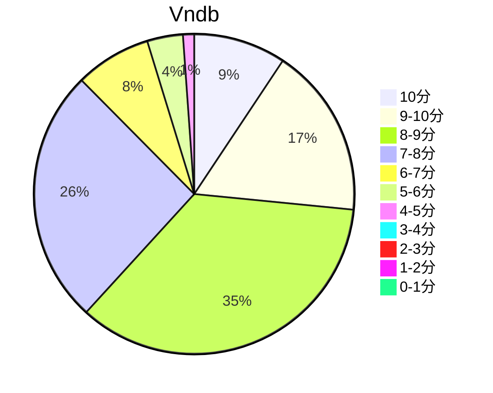

## 状态信息
### 基本信息
| 属性 | 数值 |
| --- | --- |
| 平台 | PC |
| 游戏 | 苍之彼方的四重奏 EXTRA1 |
| 原名 | 蒼の彼方のフォーリズム EXTRA1 |
| 会社 | Sprite |
| 成就 | - |
| 收集 | FULL CG |
| 时长 | 6-7h |
| 角色 | 有坂真白 |
| 性质 | FD |
| 类型 | 竞技 |
| 系列 | 苍之彼方的四重奏系列 |

### 游戏信息
| 属性 | 数值 |
| --- | --- |
| 剧本 | かづや |
| 画师 | 鈴森 |

### 发行信息
| 日期 | 合集版本 |
| --- | --- |
| 2017-06-30 | Windows |

Tips: 以有坂真白为主角制作的后日谈，于2017年6月30日发售。

## 状态统计
### 记录汇总
| 记录项 | 记录数值 |
| --- | --- |
| 天数间隔 | 2 |
| 有效天数 | 2 |
| 起始日期 | 2024-01-14 18:52:21 |
| 结束日期 | 2024-01-15 02:01:21 |
| 片段数量 | 2 |
| 片总时长 | 06:43:00 |
| 最短片段 | 02:59:00 |
| 最长片段 | 03:44:00 |

### 线路汇总
| 周目 | 事件 | 起始时间 | 结束时间 | 事件时长 | 事件长支时长 | 事件短支时长 | 总时长 |
| --- | --- | --- | --- | --- | --- | --- | --- |
| 1 | 真白 Fin | 00:00:00 | 06:43:00 | 06:43:00 | 00:00:00 | 00:00:00 | 06:43:00 |

## 游戏评分
| 评分项 | 分数 | 占比 |
| --- | --- | --- |
| 评价 | 8.4 | - |
| BGM | 8.4 | - |
| 剧情 | 8.3 | - |
| 人物 | 9.3 | - |
| CG | 9.3 | - |

## 游戏分析
### 布局分析
单线 + 一个无意义选项

### 线路汇总
真白与晶也在小镇的欢乐日常以及于partner的聚会，不像Misaki，这里全部都是日常，FC也是日常的附赠部分。

## 评价
### 经典
无

### 感想
这作甜度高于ex2，不愧是萌王，第一个ex的甜度就是爽，只是没有fc。ex2主力不是甜度，而是FC的成长，相对更加热血。Misaki和Mashiro就是一对百合，但看到真白还真忍不住叫一下，真白赛高！！！雪碧社算低产会社，卖钱全靠冷饭苍彼，其次是巧克力，据说2024有一部百合向作品。幸亏挺过了ex2的发布。期待明日香的ex，然后就是莉佳（紫发女路人），最后就是蒙面小妹的ex。顺便纪念一下远在天国的ZWEI，只有企划。目前为止算是真正结束了苍彼系列，截至目前。

## 站点信息
### 游玩时长
| 站点 | 时长 | 自动 | 最慢 | 最快 | 正常 |
| --- | --- | --- | --- | --- | --- | 
| vndb | 5h30m | 5h15m | 8h50m | 3h53m | 6h29m |

### 站点评分表
| 站点 | 评分 | 平均 | 人数 | 最高分 | 最低分 | 偏差 | rank |
| --- | --- | --- | --- | --- | --- | --- | --- |
| vndb | 7.75 | 7.75 | 1331 | 10 | 1 | - | 583 |

### 站点评分区间图

## 游戏图片
### CG截图




### 游戏截图




### 相关链接
[官方公式](https://aokana.net/extra1/)
[中文公式](https://hikarifield.co.jp/aokana_extra1/)