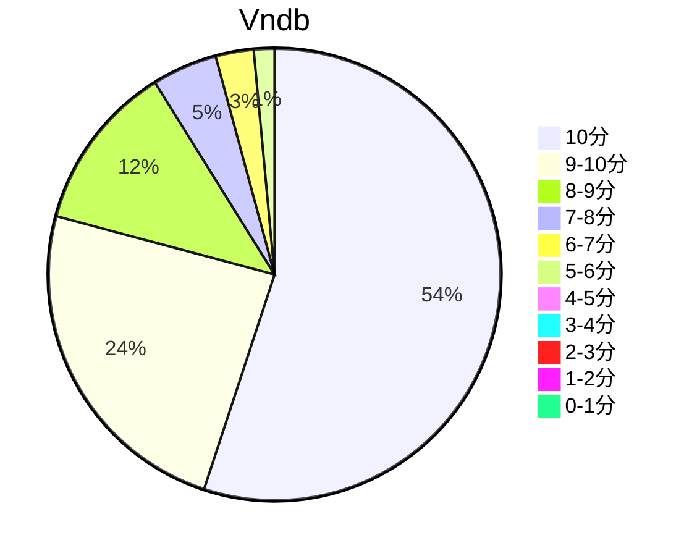

## 状态信息
### 基本信息
| 属性 | 数值 |
| --- | --- |
| 平台 | PC |
| 游戏 | 白色相簿2 |
| 原名 | WHITE ALBUM2 |
| 会社 | Leaf |
| 成就 | - |
| 收集 |  |
| 时长 | h |
| 性质 | 合集 |
| 类型 | 三角恋爱 |
| 系列 | 白学家系列 |

### Staff
| 属性 | 数值 |
| --- | --- |
| 剧本 | 丸户史明 with 企画屋 |
| 画师 | 中村毅、桂宪一郎、柳沢まさひで |

### 发行信息
| 日期 | 合集版本 |
| --- | --- |
| 2010-03-26 | IC |
| 2011-12-22 | CC |
| 2018-02-14 | Extended Edition |

Tips: 动画版本只有IC，且是东马偏向的剧情，雪莱党会被虐死。CC + Coda是故事核心。IC主要是三角势力平衡的故事背景描述。Extended Edition 整合了 IC + CC + Coda还有收录了许多细节内容。具体设定补充有官方设定集，但不代表是正确的。当作品出名的一定程度后，其解释权不为作者所拥有。

## 状态统计
### 记录汇总
| 记录项 | 记录数值 |
| --- | --- |

### 线路汇总
| 周目 | 事件 | 起始时间 | 结束时间 | 事件时长 | 事件长支时长 | 事件短支时长 | 总时长 |
| --- | --- | --- | --- | --- | --- | --- | --- |

## 游戏评分
| 评分项 | 分数 | 占比 |
| --- | --- | --- |
| 评价 | 9.5 | - |
| BGM | 9.4 | - |
| 剧情 | 9.5 | - |
| 人物 | 9.3 | - |
| CG | 9.0 | - |

## 游戏分析
### 布局分析
IC(序章) + CC(东马不在的故事+三女线路) + Coda(真正的主场)

### 线路汇总

## 评价
### 经典

### 感想

## 站点信息
### 游玩时长
| 站点 | 时长 | 自动 | 最慢 | 最快 | 正常 |
| --- | --- | --- | --- | --- | --- | 
| vndb | 72h46m | 72h30m | 100h2m | 50h | 80h |

### 站点评分表
| 站点 | 评分 | 平均 | 人数 | 最高分 | 最低分 | 偏差 | rank |
| --- | --- | --- | --- | --- | --- | --- | --- |
| vndb | 9.00 | 9.00 | 2636 | 10 | 1 | - | 2 |

### 站点评分区间图

## 游戏图片
### CG截图




### 游戏截图




### 相关链接
[IC](https://leaf.aquaplus.jp/product/wa2ic/)
[CC](https://leaf.aquaplus.jp/product/wa2cc/)
[Extended Edition](https://leaf.aquaplus.jp/product/wa2cc/product.html#wa2ex)
[Anime](http://whitealbum2.jp/)