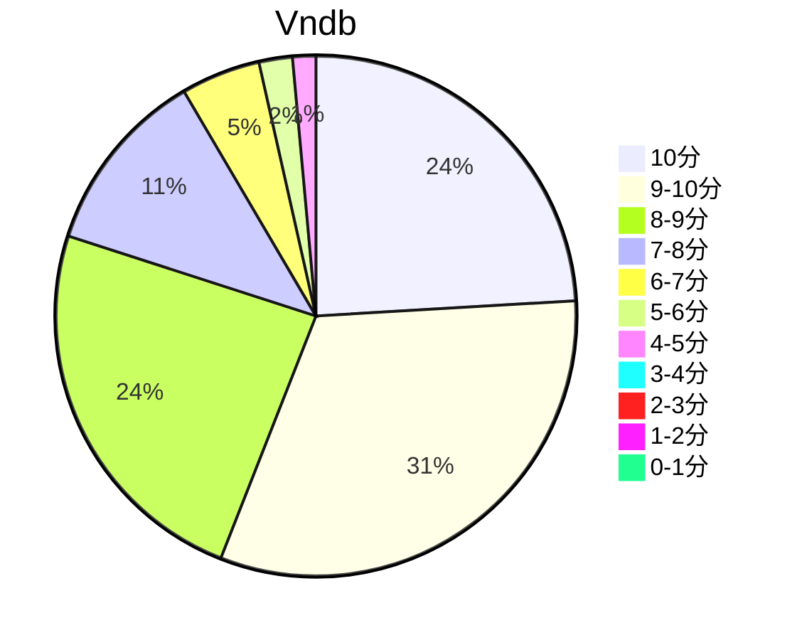

## 状态信息
### 基本信息
| 属性 | 数值 |
| --- | --- |
| 平台 | PSV |
| 游戏 | 混沌之子 |
| 原名 | Chaos;Child (カオスチャイルド) |
| 会社 | 5pb. |
| 成就 | PS Trophy |
| 收集 | FULL CG |
| 天数 | 9 |
| 时长 | 61-62h |
| 系列 | 妄想科学ADV系列 |

### 游戏信息
| 属性 | 数值 |
| --- | --- |
| 企画·原作 | 志仓千代丸 |
| プロデューサー | 松原达也 |
| メインキャラクターデザイン | ささきむつみ |
| サブキャラクターデザイン／制服デザイン | 松尾ゆきひろ |
| メインシナリオライター | 梅原英司 |
| サブシナリオライター | たきもとまさし、安本亨、林直孝 |
| シナリオ补佐 | たきもとまさし |
| シナリオ监修 | 林直孝 |
| 演出 | 若林汉二 |
| ディソードデザイン | CHOCO |
| 音乐 | 阿保刚 |
| ディレクター | 松本裕介 |

### 发行信息
| 日期 | 版本 |
| --- | --- |
| 2015-06-25 | PSV/PS3/PS4 |
| 2016-04-28 | PC |
| 2017-01-31 | IOS |

## 状态统计
### 记录汇总
| 记录项 | 记录数值 |
| --- | --- |
| 天数间隔 | 287 |
| 有效天数 | 9 |
| 起始日期 | 2023-02-23 16:30:00 |
| 结束日期 | 2023-12-06 18:52:00 |
| 片段数量 | 24 |
| 总时长 | 61:06:00 |
| 最短片段 | 00:08:00 |
| 最长片段 | 06:04:00 |

### 线路汇总
| 周目 | 线路 | 次数 | 故事时长 | 额外时长 | 游戏时长 | 线路时长 |
| --- | --- | --- | --- | --- | --- | --- |
| 1 | Over sky end | 1 | 30:39:00 | - | 30:39:00 | 30:39:00 |
| 2 | Dark sky end | 1 | 07:08:00 | - | 07:08:00 | 07:08:00 |
| 3 | 有村线 BE | 1 | 00:36:00 | - | 00:36:00 | 00:36:00 |
| 4 | Dream sky end | 1 | 05:54:00 | - | 05:54:00 | 05:54:00 |
| 5 | 山添线 BE1 | 1 | 00:06:00 | - | 00:06:00 | 00:06:00 |
| 6 | 山添线 BE2 | 1 | 00:15:00 | - | 00:15:00 | 00:15:00 |
| 7 | 山添线 BE3 | 1 | 00:04:00 | - | 00:04:00 | 00:04:00 |
| 8 | 山添线 BE4 | 1 | 00:07:00 | - | 00:07:00 | 00:07:00 |
| 9 | Another sky end | 1 | 00:16:00 | - | 00:16:00 | 00:16:00 |
| 10 | Deep sky end | 1 | 04:55:00 | - | 04:55:00 | 04:55:00 |
| 11 | 香月线 BE | 1 | 00:08:00 | - | 00:08:00 | 00:08:00 |
| 12 | Real sky end | 1 | 06:05:00 | - | 06:05:00 | 06:05:00 |
| 13 | Real sky end x2 | 1 | 00:15:00 | - | 00:15:00 | 00:15:00 |
| 14 | Silent sky end | 1 | 04:10:00 | - | 04:10:00 | 04:10:00 |
| 15 | BE | 1 | 00:09:00 | - | 00:09:00 | 00:09:00 |
| - | 刷奖杯 | - | - | 00:19:00 | 00:19:00 | 00:19:00 |

## 游戏评分
| 评分项 | 分数 | 占比 |
| --- | --- | --- |
| 评价 | 9.5 | - |
| BGM | 9.2 | - |
| 剧情 | 9.5 | - |
| 人物 | 9.1 | - |
| CG | 9.3 | - | 
| 动画 | - | - |

## 游戏分析
### 布局分析
一周目默认线路，共通妄想分支选线，探索选项通BE，L型路线。True End需要全线通关解锁。

### Bug汇总
无

### 线路汇总
- 乃乃 - 身份识别，直视谎言。
- 有村 - 蜜汁哥迷，直视现实。
- 香月 - 委员会登场，超人打怪兽。
- 羽希 - 直面现实，依赖反转/梦中梦，回归并非现实。
- 世莉 - 追逐遗失的记忆，寻求本真。

Tips: 
1. TE > 乃乃 > 有村 > 羽希 > 香月。
2. 共通剧情紧凑，爽。But，个人线除了乃乃，或多或少有问题，香月线简直脑洞大开。

## 评价
### 标签
妄想科学、情强、情弱、悬疑

### 提示
无

### 经典
我或许败北,或许迷失自己,或许哪里也抵达不了,或许我已失去一切,任凭怎么挣扎也只能徒呼奈何,或许我只是徒然掬一把废墟灰烬,唯我一人蒙在鼓里,或许这里没有任何人把赌注下在我身上。“无所谓。”我以轻微然而果断的声音对那里的某个人说道,“有一点是明确的:至少我有值得等待有值得寻求的东西。”
之后,我屏住呼吸,侧耳谛听那里应该有的低微声响。在水花声音乐声人们笑声的另一侧,我的耳朵听到了无声的微颤。那里有谁在呼唤谁,有谁在寻求谁,以不成声音的声音,以不成话语的话语。
——《奇鸟行状录》

### 感想
以前看过TV版本的Chaos系列。游戏部分补充很多细节，对环境和氛围刻画提升到了另一个层次。虽说如此，个人线还是惨不忍睹的。赤裸裸地讽刺当代网民和阿宅等群体。TE的笔墨进一步强调了妄想&现实。虽说如此，其实个人已经游走于客观世界，立足点可以，有一定的借鉴意义。至于和SG比，两部所针对的类型不同，各有其特点。初期不明白妄想系统，所以拖了一定的长时间才补完。

## 站点信息
### 游玩时长
| 站点 | 时长 | 自动 | 最慢 | 最快 | 正常 |
| --- | --- | --- | --- | --- | --- | 
| vndb | 56h40m | 53h55m | 86h | 40h30m | 59h16m |

### 站点评分表
| 站点 | 评分 | 平均 | 人数 | 最高分 | 最低分 | 偏差 |
| --- | --- | --- | --- | --- | --- | --- |
| vndb | 8.32 | 8.32 | 3522 | 10 | 1 | - |

### 站点评分区间图

## 游戏图片
### CG截图
无

### 游戏截图
无

### 相关链接
[官方公式](http://chaoschild.jp/)