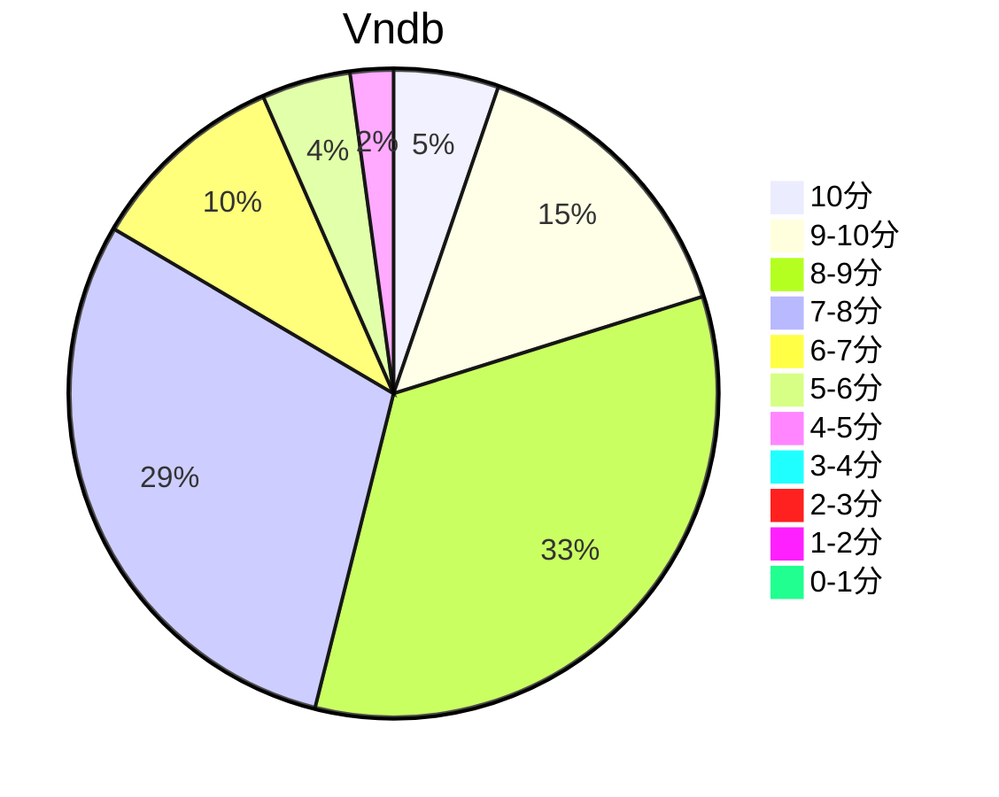

## 状态信息
### 基本信息
| 属性 | 数值 |
| --- | --- |
| 平台 | PC |
| 游戏 | 命运脉动/红色约定 |
| 原名 | Fortune Arterial (フォーチュンアテリアル) |
| 会社 | AUGUST |
| 成就 | - |
| 收集 | FULL CG |
| 天数 | 9 |
| 时长 | 61-62h |
| 引擎 | Ethornell |
| 系列 | - |

### 游戏信息
| 属性 | 数值 |
| --- | --- |
| 制作统括/总指挥 | るね |
| 人物设计/原画 | べっかんこう |
| 剧本 | 榊原拓、内田ヒロユキ、安西秀明 |
| 剧本协力 | 冈田留奈 |
| CG统括 | 里见藤久 |
| 背景 | 阿舎利ん_16、北川由貴、ゆうろ、紀山聡、有限会社シルバー、wiza kun |
| 演出 | 北川由贵 |
| 电影 | 北川由贵、Iris motion graphics |
| チビキャラアイコン | 脳みそホエホエ |
| 赞助 | よもぎ |
| 音乐 | Active Planets |

### 发行信息
| 日期 | 版本 |
| --- | --- |
| 2008-01-25 | 初回限定盘 |
| 2008-02-29 | 通常盘 |
| 2011-07-29 | Ver. Win7 |
| 2015-03-06 | Ver. DL |

## 状态统计
### 记录汇总
| 记录项 | 记录数值 |
| --- | --- |
| 天数间隔 | 287 |
| 有效天数 | 9 |
| 起始日期 | 2023-02-23 16:30:00 |
| 结束日期 | 2023-12-06 18:52:00 |
| 片段数量 | 24 |
| 总时长 | 61:06:00 |
| 最短片段 | 00:08:00 |
| 最长片段 | 06:04:00 |

### 线路汇总
| 周目 | 线路 | 次数 | 故事时长 | 额外时长 | 游戏时长 | 线路时长 |
| --- | --- | --- | --- | --- | --- | --- |

## 游戏评分
| 评分项 | 分数 | 占比 |
| --- | --- | --- |
| 评价 | 9.5 | - |
| BGM | 9.2 | - |
| 剧情 | 9.5 | - |
| 人物 | 9.1 | - |
| CG | 9.3 | - | 
| 动画 | - | - |

## 游戏分析
### 布局分析

### Bug汇总
- Win10运行原版本(Win7版本) - OP黑屏无法加载，但有声音。

### 线路汇总
- えりか - 
- しろ - 
- きりは -
- かなで -
- ひな -

Tips: 
1. 。
2. 时间顺序：しろ > 

## 评价
### 标签

### 提示
无

### 经典

### 感想

## 站点信息
### 游玩时长
| 站点 | 时长 | 自动 | 最慢 | 最快 | 正常 |
| --- | --- | --- | --- | --- | --- | 
| vndb | 30h47m | 24h38m | 46h | 26h28m | 22h11m |

### 站点评分表
| 站点 | 评分 | 平均 | 人数 | 最高分 | 最低分 | 偏差 |
| --- | --- | --- | --- | --- | --- | --- |
| vndb | 7.46 | 7.46 | 753 | 10 | 2 | - |

### 站点评分区间图

## 游戏图片
### CG截图
无

### 游戏截图
无

### 相关链接
[官方公式](https://august-soft.com/fa/)
[动漫公式](https://www.tv-tokyo.co.jp/contents/fortune/)