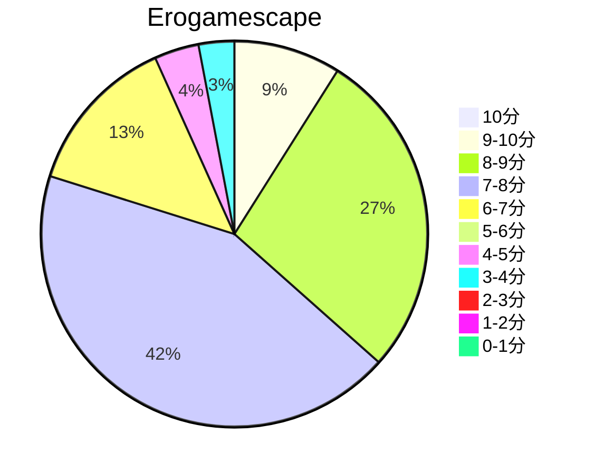
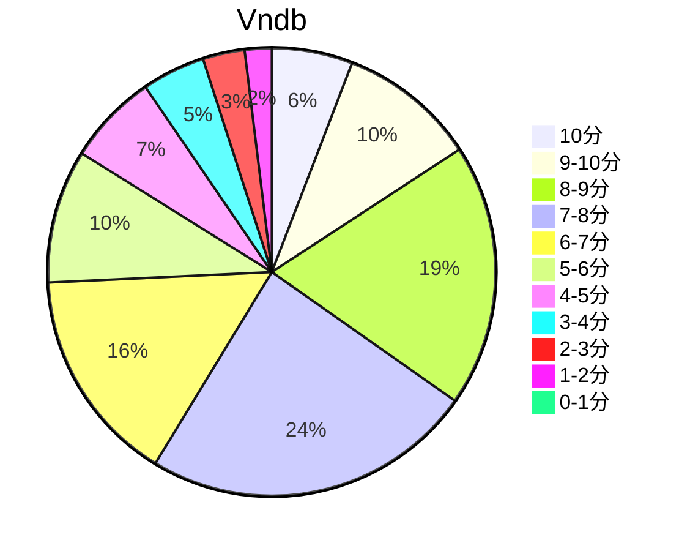

## 状态信息
### 基本信息
| 属性 | 数值 |
| --- | --- |
| 平台 | PC |
| 游戏 | School Days HQ |
| 原名 | School Days HQ |
| 会社 | overflow |
| 成就 | FULL Flowchart(exclude Bug) |
| 收集 | FULL Replay(exclude Bug) |
| 天数 | 7 |
| 时长 | 44-45h |
| 系列 | Days |

### 游戏信息
| 属性 | 数值 |
| --- | --- |
| 开发 | overflow |
| 企划、剧本、制作总指挥 | メイザーズぬまきち |
| 人物设计、总作画监督 | 后藤润二 |
| 作画监督 | 刻雨 |
| 原画 | 长森佳容、矢向宏志、仓岛丈康 |
| 美术监修 | 宫前光春 |
| 背景美术 | 仓田宪一 |
| 动画演出、分镜 | ほしかわたかふみ |
| 程序 | GON、向日葵正 |
| 音效演出 | 吉田博彦（ヨシダという生き物） |
| 音效监督 | 伊藤善之（ランティス） |
| 音效制作 | âge（アージュ） |
| 音效制作协力 | Lantis |
| 音乐 | KIRIKO/HIKO sound |
| 音响制作 | ホビボックス |
| OP电影 | 静かなる中条 |

### 发行信息
| 日期 | 版本 |
| --- | --- |
| 2005-04-28 | PC |
| 2005-07-24 | PC新装版 |
| 2007-09-28 | DVD-PG |
| 2008-01-17 | PS2 |
| 2010-06-30 | UMDPG |
| 2010-07-24 | HQ |
| 2012-01-06 | HQ DL |
| 2012-06-27 | HQ英文版 |
| 2016-01-14 | DVD-PG新装版 |

## 状态统计
### 记录汇总
| 记录项 | 记录数值 |
| --- | --- |
| 天数间隔 | 7 |
| 有效天数 | 7 |
| 起始日期 | 2023-10-25 23:49:00 |
| 结束日期 | 2023-10-31 10:26:00 |
| 片段数量 | 18 |
| 总时长 | 44:02:00 |
| 最短片段 | 00:13:00 |
| 最长片段 | 06:13:00 |

### 线路汇总
| 周目 | 线路 | 次数 | 故事时长 | 额外时长 | 游戏时长 | 线路时长 |
| --- | --- | --- | --- | --- | --- | --- |
| 9 | (ルートA) だいすき | 9 | 00:27:00 | - | 00:27:00 | 03:26:00 |
| 18 | (ルートA) 永遠に | 3 | 00:30:00 | - | 00:30:00 | 02:07:00 |
| 11 | (ルートA) 彼女だけの彼 | 3 | 00:52:00 | - | 00:52:00 | 03:14:00 |
| 13 | (ルートA) みんなの誠 | 2 | 00:09:00 | - | 00:09:00 | 03:14:00 |
| 12 | (ルートA) セックスフレンド | 2 | 00:24:00 | - | 00:24:00 | 03:29:00 |
| 20 | (ルートA) さよなら世界 | 3 | 00:39:00 | - | 00:39:00 | 01:25:00 |
| 10 | (ルートA) 刹那の想い | 4 | 00:35:00 | - | 00:35:00 | 03:47:00 |
| 5 | (ルートB) ババロア | 3 | 00:12:00 | - | 00:12:00 | 02:53:00 |
| 4 | (ルートB) 肉欲 | 3 | 00:32:00 | - | 00:32:00 | 03:13:00 |
| 1 | (ルートB) キスから先へ | 2 | 00:37:00 | - | 00:37:00 | 03:33:00 |
| 17 | (ルートC) そしてファーストキスから始まる | 2 | 00:36:00 | - | 00:36:00 | 03:19:00 |
| 19 | (ルートC) 二人の恋人 | 2 | 00:29:00 | - | 00:29:00 | 01:49:00 |
| 16 | (ルートC) 我が子へ | 3 | 00:35:00 | - | 00:35:00 | 00:59:00 |
| 21 | (ルートD) そして言葉へ | 3 | 00:38:00 | - | 00:38:00 | 01:39:00 |
| 6 | (ルートD) 一途な想いは報われて | 3 | 00:45:00 | - | 00:45:00 | 03:11:00 |
| 7 | (ルートD) そして言葉と | 3 | 00:17:00 | - | 00:17:00 | 02:43:00 |
| 8 | (ルートD) 想い結んで | 3 | 00:41:00 | - | 00:41:00 | 03:07:00 |
| 3 | (ルートD) 素直な気持ちで | 4 | 01:17:00 | - | 01:17:00 | 04:56:00 |
| 14 | (ルートD) クリスマス・イブ | 4 | 00:46:00 | - | 00:46:00 |  01:07:00 |
| 2 | (ルートD) 鮮血の結末 | 5 | 00:20:00 | - | 00:20:00 | 03:16:00 |
| 15 | (ルートD) 轢(れきし)殺 | 3 | 00:48:00 | - | 00:48:00 | 01:12:00 |
| 22 | - | 1 | - | 09:56:00 | 09:56:00 | - |

## 游戏评分
| 评分项 | 分数 | 占比 |
| --- | --- | --- |
| 评价 | 9.2 | - |
| BGM | 8.9 | - |
| 剧情 | 9.0 | - |
| 人物 | 8.9 | - |
| CG | 0 | - | 
| 动画 | 8.7 | - |

## 游戏分析
### 布局分析
4条Route的平行世界

### Bug汇总
- 路线 [很喜欢] (已验证): 网传是来自言叶的诅咒，玩过后也不会被点亮为蓝色。总路线显示为87%解锁。
- Replay [第四页第二个:世界在部屋用手机ZW] (已验证): 打过也不会被记录。也就是最下面第6话紫色线的共通事件节点。

### 线路汇总
| 人物 | 数量 | Happy End 线路 | Good End 线路 | Bad End 线路 |
| --- | --- | --- | --- | --- |
| 桂言叶 | 8 | 彼女だけの彼、キスから先へ、そしてファーストキスから始まる、そして言葉へ、そして言葉と、クリスマス・イブ | 肉欲 | 永遠に |
| 世界 | 5 | だいすき、ババロア | 想い結んで、素直な気持ちで | さよなら世界 |
| 加藤乙女 | 1 | 一途な想いは報われて | - | - |
| 刹那 | 1 | - | 刹那の想い | - |
| 光 | 2 | セックスフレンド、みんなの誠 | - | - |
| 言叶&世界 | 4 | 二人の恋人 | - | 我が子へ、鮮血の結末、轢(れきし)殺 |

Tips: 三人独有线路的女主都有专属后日谈，核心女主要看是否为官方路线和结局。世界有专属的事件BGM，言叶有大量的福利场景。可以的话建议保持平衡好感度攻略。探索的话可以极端一些。

## 评价
### 标签
动画、长篇、爱情、情杀、校园、恋爱、Days系列、人气

### 提示
Bug有点多，对全收集的洁癖党来说不友好。详情看 Bug 汇总。

### 经典
間違っていたのは俺じゃない、世界の方だ

### 感想
基于本次游玩的实际记录进行有效性分析，游戏核心周目数为22，业余周目数高达50以上。多周目后我们可以从剧情片段的补充中得到完整的人物信息，使人物更加形象丰满。  
就本次游玩体验看，世界和言叶本身挺好，但当剑走偏锋，必将引来血光之灾。三路人线可以，但没有过度的表现人物特性。但仅从线路的角度看，完美结局。世界言叶都有good end和bad end。根据数量看，言叶是一把手。但故事发展角度看属于二把手。这并不影响对游戏的分析。  
本文的目的在于人物的分析，有小部分剧透。动画版本基本上是集游戏之BE而成，可称其为混沌的漩涡。首先是言叶，初期给人的感觉是娇滴滴的贵女，后面发现言叶比较单纯，一旦发生变故，容易将事情走向另一个极端。世界的话初期想法不稳定，这也是后面酝酿成大错的契机。世界中后期还是可以的，除了黑化。世界黑化后恐怖程度不亚于言叶。  
如果仅仅是从故事角度，那只有8分，这个校园故事在当年是烂大街类型，黑化也类似。但如今，有情怀和稀有事件加成。我决定给9分，一是剧情多周目加成，二是沉浸式的环境加成，里面的人物基本的事件已经了如指掌，一系列要素综合后的分数呈现就是9.2。BGM少而又不失特色，这也是要素加成之一。这部游戏仅适合传教于非常人。就个人而言，很好，以前算佳作，现在可以算是神作。大环境的原因，主题要素往废萌转移，内容质量整体下滑是不可避免的趋势。这也是我第一次接触的动画游戏，算是将初中的梦圆了。

## 站点信息
### 游玩时长
| 站点 | 时长 | 自动 | 最慢 | 最快 | 正常 |
| --- | --- | --- | --- | --- | --- | 
| vndb | 34h | 24h | 75h | 16h13m | 34h |

### 站点评分表
| 站点 | 评分 | 平均 | 人数 | 最高分 | 最低分 | 偏差 |
| --- | --- | --- | --- | --- | --- |  --- |
| erogamescape | 7.5 | 7.4 | 137 | 100 | 25 | 13 |
| vndb | 6.55 | 6.55 | 3698 | 10 | 1 | - |

### 站点评分区间图

## 游戏图片
### CG截图

### 游戏截图










### 全线路图(Ctrl+M)







### 全路线封面(21条线路)




### 相关链接
[官方公式](https://0verflow.com/products/schooldayshq/)
[中文公式](https://0verflow.com/ch/products/sdhq/)