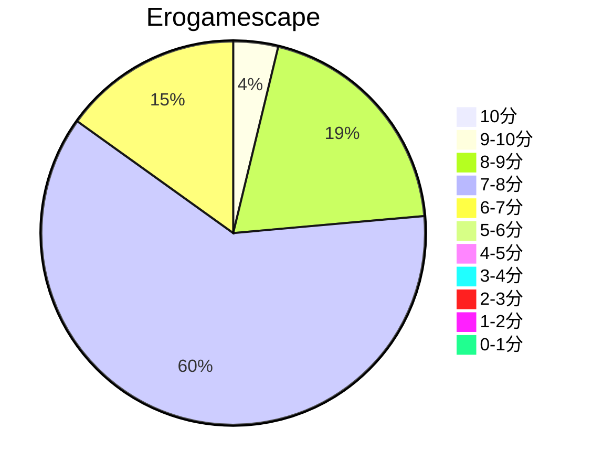
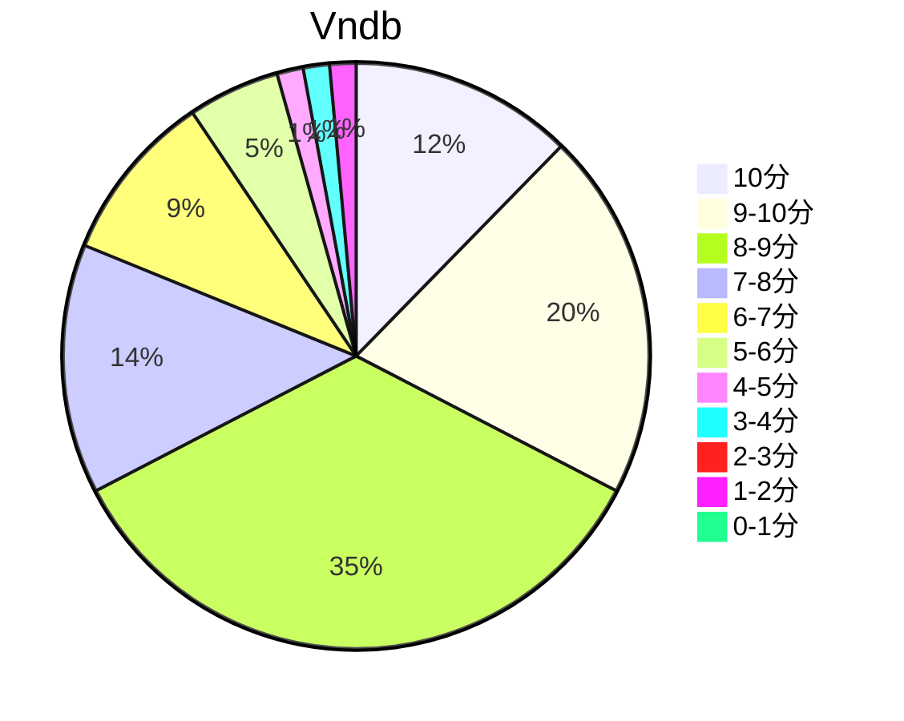

## 状态信息
### 基本信息
| 属性 | 数值 |
| --- | --- |
| 平台 | PC |
| 游戏 | Ginka |
| 原名 | Ginka |
| 会社 | FrontWing |
| 成就 | - |
| 收集 | FULL CG |
| 天数 | 3 |
| 时长 | 12-13h |
| 系列 | - |

### 游戏信息
| 属性 | 数值 |
| --- | --- |
| 编剧 | 紺野アスタ |
| 原画、角色设计 | ゆさの |
| 角色设计（副） | 渡边明夫 |
| SD原画 | ななかまい |
| 监督 | かづや、molion、kur |
| 制作人 | 山川龙一郎 |

### 发行信息
| 日期 | 版本 |
| --- | --- |
| 2023-10-26 | PC |

## 状态统计
### 记录汇总
| 记录项 | 记录数值 |
| --- | --- |
| 天数间隔 | 3 |
| 有效天数 | 3 |
| 起始日期 | 2023-11-02 21:44:00 |
| 结束日期 | 2023-11-04 09:31:00 |
| 片段数量 | 5 |
| 总时长 | 12:00:00 |
| 最短片段 | 00:35:00 |
| 最长片段 | 04:38:00 |

### 线路汇总
| 周目 | 线路 | 次数 | 故事时长 | 额外时长 | 游戏时长 | 线路时长 |
| --- | --- | --- | --- | --- | --- | --- |
| 1 | Bad End 3 | 1 | 00:08:00 | - | 00:08:00 | 06:04:00 |
| 2 | Ginka End | 1 | 06:58:00 | - | 06:58:00 | 06:58:00 |
| 3 | Ginka Next End | 1 | 04:54:00 | - | 04:54:00 | 11:52:00 |

## 游戏评分
| 评分项 | 分数 | 占比 |
| --- | --- | --- |
| 评价 | 9.1 | - |
| BGM | 9.2 | - |
| 剧情 | 9.0 | - |
| 人物 | 9.0 | - |
| CG | 9.1 | - | 
| 动画 | - | - |

## 游戏分析
### 布局分析
单核心线路 + 短分支BE构成

### Bug汇总
- 无

### 线路汇总
| 人物 | 数量 | Happy End 线路 | Good End 线路 | Bad End 线路 |
| --- | --- | --- | --- | --- |
| Ginka | 2 | Ginka Next End | Ginka End | - |

Tips: 选项无难度，只要认真选，选错就是BE。新篇章的next是主篇章的接续。

## 评价
### 标签
ゆさの、短篇、神树、诅咒、蝴蝶、梦、巫女

### 提示
无

### 经典
ふるふる

### 感想
前期的剧情反馈有点像SPRB，配合上松本文纪的音乐整体的神秘感表现不错。打斗方面有点儿戏，不过不影响剧情的深入。主题依旧是人和神明的相互作用。next的结尾略显草率，使得文本在后篇留下不少漏洞。与ATRI相比，剧情方面是差不多，但是ATRI的剧情内容比较完整。整个心里周期基本是：起伏-波动-平淡-低谷-高潮-波动-(next)-平坦-波动-高潮-现实短糖-回忆高糖。这部作品还是值得一看。本体结局会给人带来消失后的失落感，因为已知范围内确实如此，特别是信件部分。next将本体补全，但剧情体验会下降一部分，取而代之就是幸福结局。8U们提及的平行世界才在一起的结局，他们明显忽略了前面的回归与在一起。也就里面糖的数量没有想象的那么多。
故事讲的是：神明请愿的诅咒，最终神明因为某个事情改变了现有的看法。给他们带来了祝福。宛如蝴蝶重新展翅传播花粉。诅咒是爱慕男主的心与本体分离，简而言之就是抽象为情感的人格。解除对本体诅咒只有两种，杀掉神明和感化神明。

## 站点信息
### 游玩时长
| 站点 | 时长 | 自动 | 最慢 | 最快 | 正常 |
| --- | --- | --- | --- | --- | --- | 
| vndb | 11h28m | 11h28m | 16h24m | 6h | 12h8m |

### 站点评分表
| 站点 | 评分 | 平均 | 人数 | 最高分 | 最低分 | 偏差 |
| --- | --- | --- | --- | --- | --- |  --- |
| erogamescape | 7.5 | 7.4 | 109 | 10 | 1 | 1 |
| vndb | 7.63 | 7.63 | 139 | 10 | 1 | - |

### 站点评分区间图

## 游戏图片
### CG截图




### 游戏截图










### 相关链接
[官方公式](http://ginka.frontwing.jp/)
[Twitter](https://twitter.com/ginka_fw)
[Steam](https://store.steampowered.com/app/2536840/GINKA/)