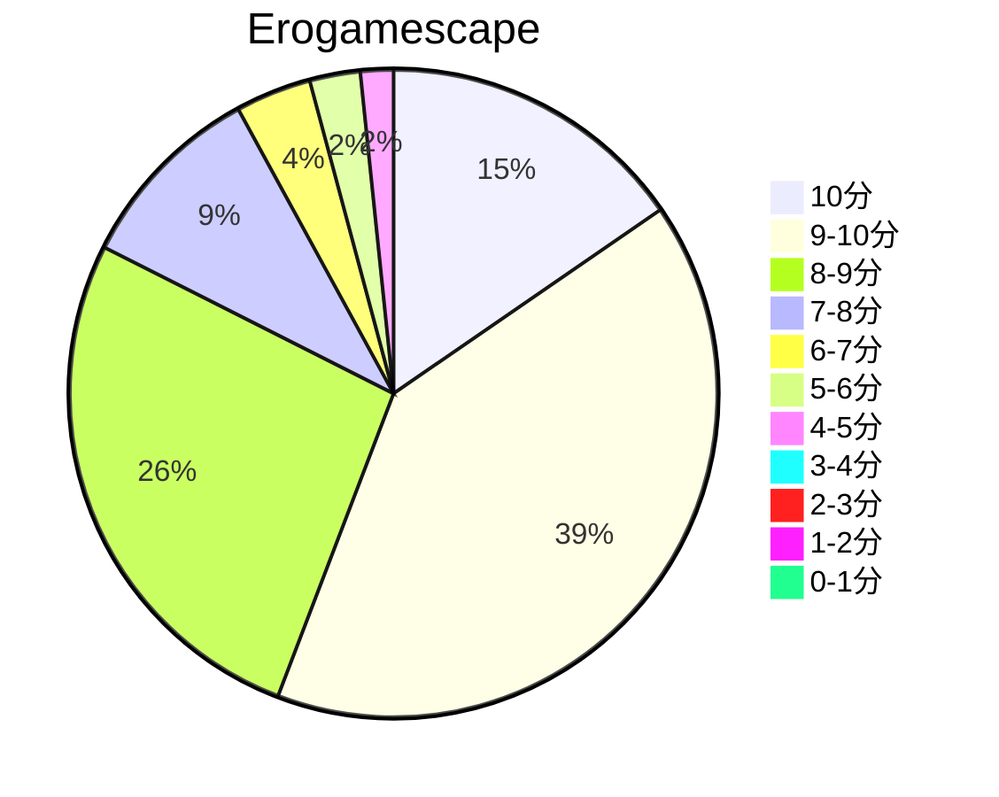
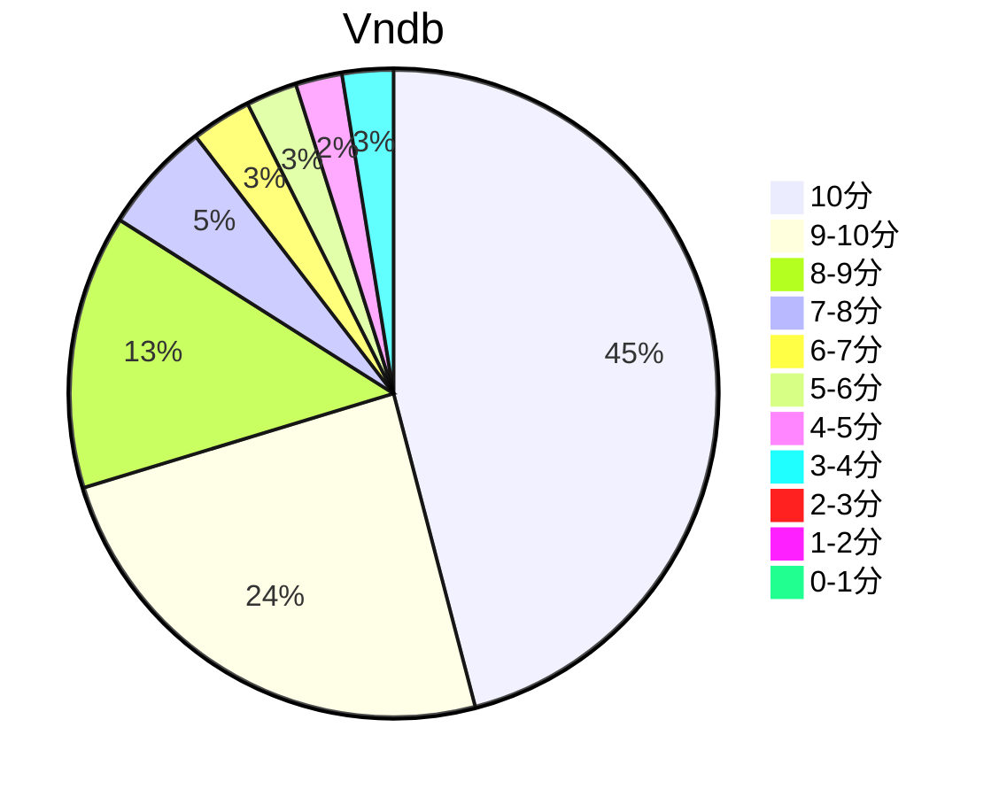

## 状态信息
### 基本信息
| 属性 | 数值 |
| --- | --- |
| 平台 | PC |
| 游戏 | 樱花萌放 |
| 原名 | さくら、もゆ。-as the Night's, Reincarnation- |
| 会社 | FAVORITE |
| 成就 | - |
| 收集 | FULL CG |
| 天数 | 13 |
| 时长 | 72-73h |
| 系列 | - |

### 游戏信息
| 属性 | 数值 |
| --- | --- |
| 开发 | FAVORITE |
| 制作人 | 水间ホシひと |
| 剧本 | 漆原雪人 |
| 原画 | 司田カズヒロ、なつめえり、ミズタマ(SD) |
| 音乐 | 忍 |

### 发行信息
| 日期 | 版本 |
| --- | --- |
| 2019-01-31 | PC |
| 2023-02-22 | PS4、NS |

## 状态统计
### 记录汇总
| 记录项 | 记录数值 |
| --- | --- |
| 天数间隔 | 14 |
| 有效天数 | 13 |
| 起始日期 | 2023-11-10 08:47:00 |
| 结束日期 | 2023-11-23 15:37:00 |
| 片段数量 | 30 |
| 总时长 | 72:58:00 |
| 最短片段 | 00:11:00 |
| 最长片段 | 06:09:00 |

### 线路汇总
| 周目 | 线路 | 次数 | 故事时长 | 额外时长 | 游戏时长 | 线路时长 |
| --- | --- | --- | --- | --- | --- | --- |
| 1 | 序章 | 1 | 03:41:00 | - | 03:41:00 | 03:41:00 |
| 1 | 共通 | 1 | 08:22:00 | - | 08:22:00 | 12:03:00 |
| 1 | 千和 End | 1 | 12:58:00 | - | 12:58:00 | 25:01:00 |
| 2 | 姬織 End | 1 | 09:36:00 | - | 09:36:00 | 13:17:00 |
| 3 | 春 End | 1 | 14:41:00 | - | 14:41:00 | 18:22:00 |
| 4 | 小黑 End | 1 | 15:12:00 | - | 15:12:00 | 33:34:00 |
| 5 | 小黑 二周目:劇情梳理 | 1 | 08:28:00 | - | 08:28:00 | 08:28:00 |

## 游戏评分
| 评分项 | 分数 | 占比 |
| --- | --- | --- |
| 评价 | 9.5 | - |
| BGM | 9.5 | - |
| 剧情 | 9.4 | - |
| 人物 | 9.1 | - |
| CG | 9.1 | - | 
| 动画 | - | - |

## 游戏分析
### 布局分析
千和与鸡汁都属于独立世界线，小春与小黑属于主世界线。小春线是小黑线中男主回溯的结果之一，两者相互关联，但大后期基本是小黑。

### Bug汇总
无

### 线路汇总
- 千和 - 父爱（Nahato存在感巅峰）
- 鸡汁 - 母爱（线路质量不行）
- 小春 - 轮回的始末（幼童时期的原生家庭）
- 小黑 - 救赎&自我牺牲（前期真白赛高，后期转战小黑厨子）

Tips: 
1. 小黑 > 小春 > 千和 > 鸡汁。质量不一定一样，特别是小黑部分。至于鸡汁就是鸡汁，跑不了的。
2. 主线的穿插是小黑与奏大雅的电话，在电话中通过历史片段叙事的方式唤起奏大雅，然后拯救男主创造出大家幸福的世界。

## 评价
### 标签
爱、勇气、雪人、自我牺牲、魔法、童话、火车、轮回、雪人语、长篇、坐牢、感动、亲情

### 提示
雪人语非常地坐牢，请坚持到千和或者小春。选项的第一个地理位置将决定线路走向，后面两个纯托。初期就是在共通线坐牢，已经多次怀疑人生，直到后面才发现，值了，小黑线已经2周目。还有一个就是HS部分纯粹是任务指标，地方有点离谱别见怪，可以理解为外包或不存在的部分。这HS在评分网里面属于最没实用价值的评级，基本都C了。

### 经典
（轮回）今の大雅を助けられる方法は、道具は、魔法は、ここには、ゆめのねどこにはないだろうけれど。でも、私の中にはそれはあるんだよ。この電話を君が切る。それを合図にしよう。そうすれば、全部元通りになるはずだから。それでもね、今日、ひとつだけ自分の気持ちについてわかったんだよ。大好き、私は君のことが大好きだよ。きみがこの世界生まれてきてくれて、本当に、よかった。

### 感想
唉，这雪人语看得太折磨了，一句话拆成n部分，而且还不断重复。还有部分片段写得真像代码片段，改改就是另一段剧情，还有时间乱序，特别是小黑线。一周目基本都看明白另外三条，游戏好感度是9.2分左右。到了小黑线，一周目感觉在梦游，看完居然不知道讲了什么。太令人抓狂了，当时观感是5.0分。然后结合某篇梳理文再次看小黑线，除了C熟悉的片段，这次就是逐句话看。当思路一通瞬间好感上来了，感觉这还是很爽的一个剧情，虽然这破刀子还是在某个地方猛拽，但女主最后的幸福世界总算看懂了，时不时带点小感动。小黑赛高！！！可惜这白毛LOLI推不了。这条线碎片剧情片段有点多，多少还涉及点时间线问题，看漏之后，后面容易懵逼。轮回这OP2就是这游戏的精髓，特别是小黑的话还有真白的走秀，妙。

## 站点信息
### 游玩时长
| 站点 | 时长 | 自动 | 最慢 | 最快 | 正常 |
| --- | --- | --- | --- | --- | --- | 
| vndb | 60h43m | 62h48m | 80h | 37h13m | 64h4m |

### 站点评分表
| 站点 | 评分 | 平均 | 人数 | 最高分 | 最低分 | 偏差 |
| --- | --- | --- | --- | --- | --- |  --- |
| erogamescape | 9.0 | 8.6 | 815 | 100 | 0 | 1.7 |
| vndb | 8.57 | 8.57 | 439 | 10 | 1 | - |

### 站点评分区间图

## 游戏图片
### CG截图




### 游戏截图




### 相关链接
[官方公式](http://www.favo-soft.jp/soft/product/sakura/index.html)