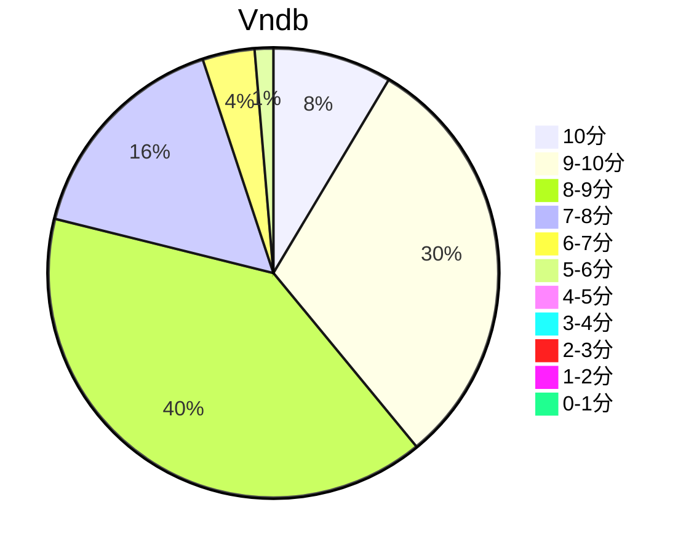

## 状态信息
### 基本信息
| 属性 | 数值 |
| --- | --- |
| 平台 | PSV |
| 游戏 | 少女理论及其周边 |
| 原名 | 乙女理論とその周辺 -Bon Voyage- |
| 会社 | Navel |
| 成就 | PS Trophy |
| 收集 | FULL CG |
| 天数 | 12 |
| 时长 | 58-59h |
| 系列 | 近月少女的礼仪 |

### 游戏信息
| 属性 | 数值 |
| --- | --- |
| 开发 | Navel |
| 剧本 | 東ノ助、真紀士、王雀孫、森林彬 |
| 原画 | 铃平广、西又葵、羽純りお（サブ） |
| 音乐 | 菊池司 |

### 发行信息
| 日期 | 版本 |
| --- | --- |
| 2013-07-26 | PC |
| 2016-11-24 | PSV |

## 状态统计
### 记录汇总
| 记录项 | 记录数值 |
| --- | --- |
| 天数间隔 | 14 |
| 有效天数 | 12 |
| 起始日期 | 2023-11-15 10:35:00 |
| 结束日期 | 2023-11-28 17:21:00 |
| 片段数量 | 23 |
| 总时长 | 58:00:00 |
| 最短片段 | 00:19:00 |
| 最长片段 | 06:53:00 |

### 线路汇总
| 周目 | 线路 | 次数 | 故事时长 | 额外时长 | 游戏时长 | 线路时长 |
| --- | --- | --- | --- | --- | --- | --- |
| 1 | 共通 | 1 | 20:42:00 | - | 20:42:00 | 20:42:00 |
| 1 | プリュエット End | 1 | 13:45:00 | - | 13:45:00 | 34:27:00 |
| 2 | メリル End | 1 | 07:07:00 | - | 07:07:00 | 27:49:00 |
| 3 | りそな End | 1 | 13:41:00 | - | 13:41:00 | 34:23:00 |
| 4 | その他1 End | 1 | 02:00:00 | - | 02:00:00 | 22:42:00 |
| 5 | その他2 End | 1 | 00:16:00 | - | 00:16:00 | 20:58:00 |
| - | 余計部分 | 1 | - | 00:29:00 | 00:29:00 | 00:29:00 |

## 游戏评分
| 评分项 | 分数 | 占比 |
| --- | --- | --- |
| 评价 | 8.5 | - |
| BGM | 8.3 | - |
| 剧情 | 8.4 | - |
| 人物 | 8.7 | - |
| CG | 8.9 | - | 
| 动画 | - | - |

## 游戏分析
### 布局分析
标准树形分支，两选项组合决定线路，4选项，线路共5条。

### Bug汇总
无

### 线路汇总
- 大藏里想奈 - 赢得巴黎时装设计展。
- 梅丽尔·琳琪 - 相认加上亲事，赢得巴黎设计师奖并且回宴会上和游星秀恩爱。 
- 布琉艾特·妮科莱特·普朗凯特 - 间接鼓舞游星，让其达到目的，并通过时装秀让其得到关键的一票。
- 迪特琳德·茨威格特 - 游星赢得选票，接受家庭婚约，和迪特琳德·茨威格特一起。
- 衣远&骏河 - 两人成为胜任的当家游星的执事，互相调侃教育方案。

Tips: 
1. 里想奈 > 梅丽尔 > 布琉艾特 > 迪特琳德 = 衣远&骏河。主线只有前两条，第三个的重置线可看后理论，本篇的出场率和事件参与度有点低。
2. After Story 里面属于近月篇的广告，含有这部分CG，但看过近月可以直接略过，奖杯也不包含这部分。

## 评价
### 标签
近月、伪娘、女校、服装、设计、家庭、贵族

### 提示
家庭主线剧情信息部分比近月多。

### 经典
无

### 感想
感觉不错，都是服装设计院校的欢乐日常，主线就不同于近月，而是涉及到两派之争。有种宫斗剧的感觉，看过近月，因此看少女理论基本算是重温近月系列的节奏。

## 站点信息
### 游玩时长
| 站点 | 时长 | 自动 | 最慢 | 最快 | 正常 |
| --- | --- | --- | --- | --- | --- | 
| vndb | 25h9m | 32h5m | 42h44m | 12h37m | 28h57m |

### 站点评分表
| 站点 | 评分 | 平均 | 人数 | 最高分 | 最低分 | 偏差 |
| --- | --- | --- | --- | --- | --- |  --- |
| vndb | 8.12 | 8.12 | 377 | 10 | 3 | - |

### 站点评分区间图

## 游戏图片
### CG截图
无

### 游戏截图
无

### 相关链接
[官方公式](https://project-navel.com/otomeriron/)