[Mermaid中文文档](https://mermaid.nodejs.cn/syntax/flowchart.html)

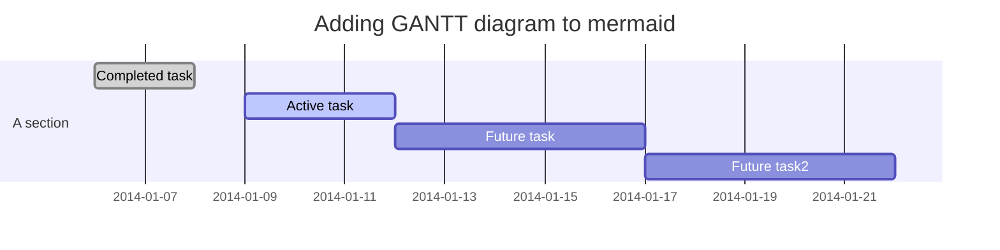
```mermaid
gantt
dateFormat  YYYY-MM-DD
title Adding GANTT diagram to mermaid

section A section
Completed task            :done,    des1, 2014-01-06,2014-01-08
Active task               :active,  des2, 2014-01-09, 3d
Future task               :         des3, after des2, 5d
Future task2               :         des4, after des3, 5d
```

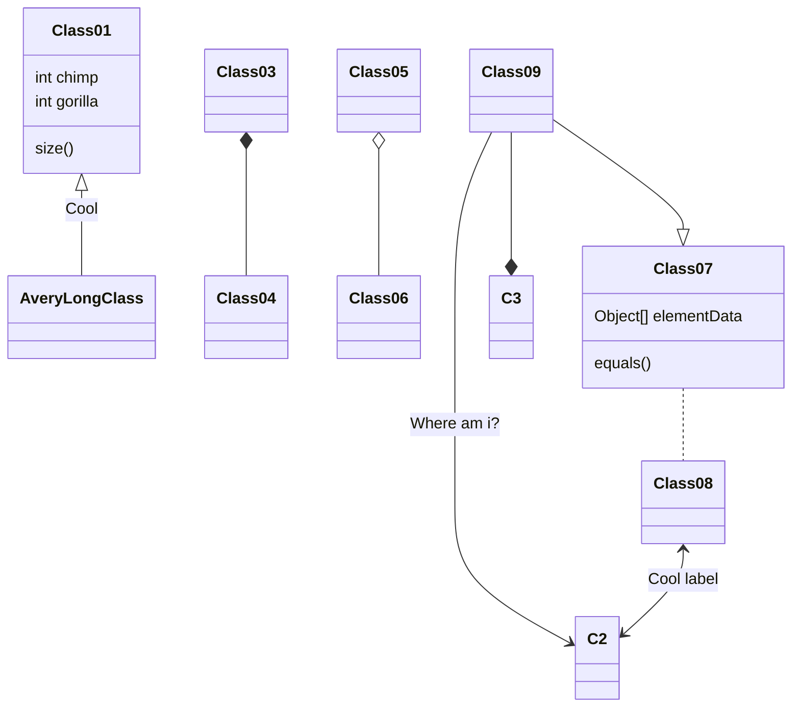
```mermaid
classDiagram
Class01 <|-- AveryLongClass : Cool
Class03 *-- Class04
Class05 o-- Class06
Class07 .. Class08
Class09 --> C2 : Where am i?
Class09 --* C3
Class09 --|> Class07
Class07 : equals()
Class07 : Object[] elementData
Class01 : size()
Class01 : int chimp
Class01 : int gorilla
Class08 <--> C2: Cool label
```

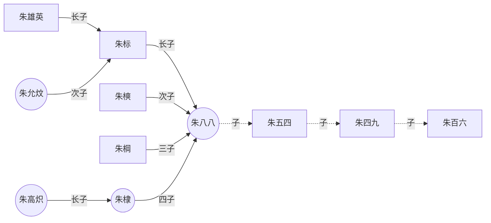
```mermaid
graph LR
emperor((朱八八))-.子.->朱五四-.子.->朱四九-.子.->朱百六


朱雄英--长子-->朱标--长子-->emperor
emperor2((朱允炆))--次子-->朱标
朱樉--次子-->emperor
朱棡--三子-->emperor
emperor3((朱棣))--四子-->emperor
emperor4((朱高炽))--长子-->emperor3
```

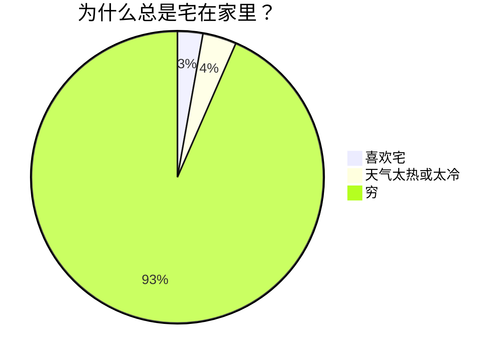
```mermaid
pie
    title 为什么总是宅在家里？
    "喜欢宅" : 15
    "天气太热或太冷" : 20
    "穷" : 500
```

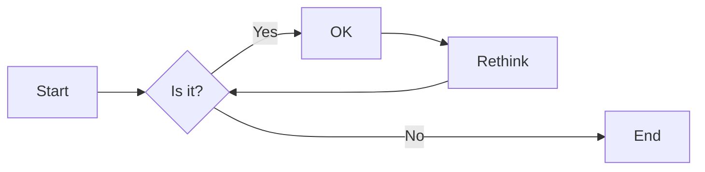
```mermaid
graph LR
    A[Start] --> B{Is it?};
    B -- Yes --> C[OK];
    C --> D[Rethink];
    D --> B;
    B -- No ----> E[End];
```

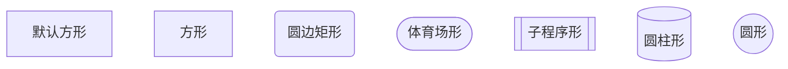
```mermaid
graph
    默认方形
    id1[方形]
    id2(圆边矩形)
    id3([体育场形])
    id4[[子程序形]]
    id5[(圆柱形)]
    id6((圆形))
```

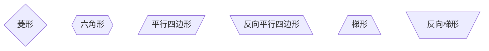
```mermaid
graph
	id1{菱形}
	id2{{六角形}}
	id3[/平行四边形/]
	id4[\反向平行四边形\]
	id5[/梯形\]
	id6[\反向梯形/]
```

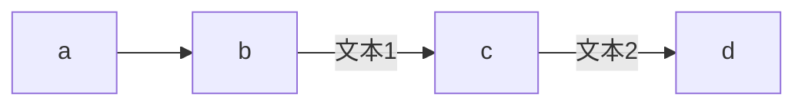
```mermaid
graph LR
    a-->b--文本1-->c-->|文本2|d
```

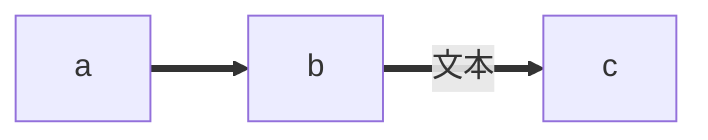
```mermaid
graph LR
    a==>b==文本==>c
```

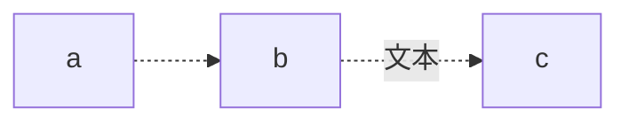
```mermaid
graph LR
    a-.->b-.文本.->c
```

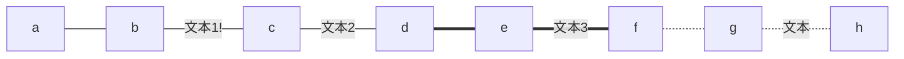
```mermaid
graph LR
    a---b
    b--文本1!---c
    c---|文本2|d
    d===e
    e==文本3===f
    f-.-g
    g-.文本.-h
```

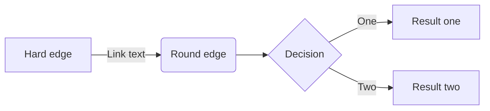
```mermaid
graph LR
%%这是一条注释，在渲染图中不可见
    A[Hard edge] -->|Link text| B(Round edge)
    B --> C{Decision}
    C -->|One| D[Result one]
    C -->|Two| E[Result two]
```
